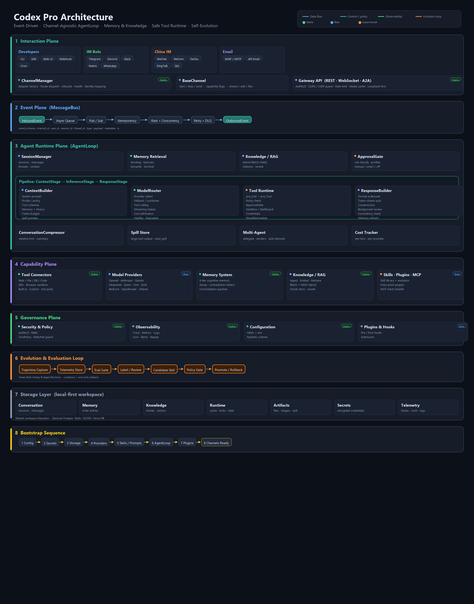

<div align="center">

# Codex Pro

**An AI Agent that remembers the past and learns for the future**

<a href="https://github.com/promoteAI/codex-pro">
  
</a>

<br/>

[](https://pypi.org/project/codex-pro/)
[](https://pypi.org/project/codex-pro/)
[](https://github.com/promoteAI/codex-pro/actions/workflows/ci.yml)
[](https://codex-pro.io/codex-pro/en/)
[](LICENSE)
[](https://pepy.tech/project/codex-pro)
[](https://github.com/promoteAI/codex-pro)

[中文](README.md) · English · [Documentation](https://codex-pro.io/codex-pro/en/)

</div>

---

## What is Codex Pro

Codex Pro is a self-hosted, long-running AI Agent. Unlike one-off Q&A, it can:

- **Cross-session memory** — Four-tier cognitive memory with automatic decay and contradiction detection, solving memory explosion in long-running scenarios. Conversations never start from scratch.
- **Self-evolving skills** — Generates improvement candidates from real execution traces, validated against an eval set before taking effect. Supports rollback.
- **Unified multi-entry** — CLI, Gateway, Webhook, Cron and [14 channels](https://codex-pro.io/codex-pro/en/integrations/channels/) in total (Telegram / Discord / Slack / WeChat / WeCom / Feishu / DingTalk / QQ / WhatsApp / Email / Matrix) share one state.
- **Safe and auditable** — High-risk tool calls go through unified approval, credentials are encrypted at rest, execution logs are fully auditable.

---

## Quick Start

Requirements: Python 3.11+, at least one model API key.

```bash
# Install
pip install "codex-pro[all]"

# Interactive setup wizard (prompts for your model API key; data lives in ~/.codex-pro by default)
codex-pro setup

# Run an interactive conversation
codex-pro run
```

Behind a slow PyPI mirror, pass an index explicitly: `pip install "codex-pro[all]" -i <index-url>`. On Windows the same three commands work in PowerShell.

<details>
<summary>Source install script (Linux / macOS / WSL2)</summary>

`scripts/install.sh` is a separate path from `pip install`: it clones the source into `~/.codex-pro`, creates a dedicated virtual environment, installs the `[all]` extras, and can register the gateway as a resident service. Use it when you intend to modify the source or want the resident deployment done in one step; for the released package, `pip install` is enough.

The script is downloaded first so its contents can be reviewed before execution:

```bash
# GitHub
curl -fsSL -o install.sh https://raw.githubusercontent.com/codex-pro/master/scripts/install.sh
# Gitee mirror (faster inside mainland China)
curl -fsSL -o install.sh https://gitee.com/promoteAI/codex-pro/raw/master/scripts/install.sh

less install.sh && bash install.sh
```

```bash
# The script probes both code hosts and clones from whichever answers faster;
# it can also be pinned explicitly:
bash install.sh --repo github
bash install.sh --repo gitee

bash install.sh --reconfigure    # run the setup wizard again
bash install.sh --skip-setup     # install the code only, without the wizard

# Every flag and environment variable:
bash install.sh --help
```

`--repo` applies to `git clone` / `fetch` only. The embedding and rerank model packages are split across release assets, so they always try the Gitee release first and fall back to GitHub regardless of this flag. `--no-mirror-probe` disables all three speed probes (PyPI index, code host, Node.js dist mirror), leaving each at its first configured default.

Re-running the script upgrades in place: when an existing valid configuration is detected, the wizard is skipped and the configuration is left untouched.

</details>

For the trade-offs between installation methods, the dependency extras beyond `[all]`, and uninstall steps, see the [installation guide](https://codex-pro.io/codex-pro/en/getting-started/installation/).

### Common commands

```bash
codex-pro run              # Interactive conversation (plain terminal line input)
codex-pro setup            # Setup wizard (models, channels, permissions; safe to rerun)
codex-pro status           # Show current configuration status
codex-pro gateway          # Run the resident gateway in the foreground
codex-pro gateway install  # Register the gateway as a background service (recommended, see below)
codex-pro cli              # Attach to the local resident gateway as a thin client (terminal TUI)
codex-pro cost             # Show cost attribution report
codex-pro web build  # Build the Codex Pro web UI bundle (on demand, for source installs)
```

> Inspect configuration with the CLI: `codex-pro config explain <key>` for a single option (description, type, default and allowed values), `codex-pro config dump` to view the active configuration (secrets are redacted), and `codex-pro config validate` to check a config file.

For every subcommand and flag see the [CLI reference](https://codex-pro.io/codex-pro/en/reference/cli/); for every configuration option see the [configuration reference](https://codex-pro.io/codex-pro/en/reference/configuration/).

### Running as a background service

Both `codex-pro run` and `codex-pro gateway` are foreground processes — they exit when the terminal closes. For a 24/7 resident agent, register the gateway as a system service (a user-level LaunchAgent on macOS, a user-level systemd unit on Linux; no root required, auto-start at login, auto-restart on crash):

```bash
codex-pro gateway install    # register the background service
codex-pro gateway start      # start it
codex-pro gateway status     # check whether it is running
codex-pro gateway logs -f    # follow the logs
codex-pro gateway restart    # restart (run once after upgrading codex-pro)
codex-pro gateway stop       # stop it
codex-pro gateway uninstall  # unregister
```

Once the gateway is running, attach from any local terminal with `codex-pro cli` to talk to the same resident agent (separate session, shared memory). The gateway listens on local loopback only (127.0.0.1); remote addresses are not supported — use ssh for remote access.

Two environment differences to note: Linux user services stop with the login session, so `sudo loginctl enable-linger $USER` keeps the service running after logout; on hosts without systemd (WSL2 in its default configuration, containers) use tmux to hold the foreground process instead, e.g. `tmux new -s codex-pro 'codex-pro gateway'`. System-wide registration and service-file updates are covered in [background service](https://codex-pro.io/codex-pro/en/operations/background-service/).

> **Local access boundary**: with no additional configuration the loopback gateway accepts two kinds of client — `codex-pro cli`, and native clients that send no browser `Origin` (scripts, SDKs). Browser requests carrying a cross-site `Origin` are rejected, preventing a web page from driving the local agent through the user's browser (CSRF). See [gateway authentication](https://codex-pro.io/codex-pro/en/integrations/gateway/authentication/) for opening access to a browser or the playground.

---

## Documentation

Full documentation lives at **[codex-pro.io/codex-pro](https://codex-pro.io/codex-pro/en/)**. This README covers installation and getting started.

| | |
|---|---|
| [Getting Started](https://codex-pro.io/codex-pro/en/getting-started/) | Installation, quickstart, upgrade and uninstall |
| [Guides](https://codex-pro.io/codex-pro/en/guides/) | Models, tools and permissions, memory, knowledge base, tasks, web UI, cost |
| [Concepts](https://codex-pro.io/codex-pro/en/concepts/) | Architecture, agent loop, memory system, event delivery, security model, skill evolution |
| [Integrations](https://codex-pro.io/codex-pro/en/integrations/) | Channels, gateway, MCP, A2A, plugins and skills |
| [Operations](https://codex-pro.io/codex-pro/en/operations/) | Deployment, background service, observability, backup, hardening, troubleshooting |
| [Reference](https://codex-pro.io/codex-pro/en/reference/) | CLI, configuration, environment variables, gateway API, tool catalog, glossary |

---

## Architecture

<div align="center">
  
</div>

For component boundaries and data flow see [architecture](https://codex-pro.io/codex-pro/en/concepts/architecture/); for the repository layout see the [code map](https://codex-pro.io/codex-pro/en/development/repository-map/).

---

## Use Cases

- The agent runs on your own machine or server, with a complete audit trail
- Conversations, preferences and task experience need to persist across sessions
- Agent skills should keep improving from real usage rather than being fixed at release
- Multiple entry points (CLI, Webhook, chat bots) need to share one set of memory and permissions
- High-risk tools require mandatory approval to prevent accidental damage
- Several model providers are in use at once, routed by task type

For deployment shapes, capacity planning and the hardening checklist see the [operations docs](https://codex-pro.io/codex-pro/en/operations/).

---

## Capabilities

| Module | Description | Docs |
|--------|-------------|------|
| **Agent loop** | Receive events → build context → call model → execute tools, shared across all entry points | [Agent loop](https://codex-pro.io/codex-pro/en/concepts/agent-loop/) |
| **Cognitive Memory** | Working / Episodic / Semantic / Archival four tiers, with decay, contradiction detection and importance reranking | [Memory system](https://codex-pro.io/codex-pro/en/concepts/memory-system/) |
| **Hybrid Retrieval** | BM25 + FAISS vector fusion, adaptive weighting per query, graceful degradation without FAISS | [Knowledge base](https://codex-pro.io/codex-pro/en/guides/knowledge-base/) |
| **Self-Evolution** | Trajectory recording → candidate generation → eval comparison → promote/reject, with cooldown and rollback | [Evolution & evaluation](https://codex-pro.io/codex-pro/en/concepts/evolution-evaluation/) |
| **Model Routing** | Main reasoning, context compression, embeddings and risk approval each configurable with independent provider and model | [Routing & fallback](https://codex-pro.io/codex-pro/en/guides/models/routing-fallback/) |
| **Tool Approval** | Three modes: `manual` / `smart` / `off`, unattended channels default to denying high-risk calls | [Tools & permissions](https://codex-pro.io/codex-pro/en/guides/tools-permissions/) |
| **Multi-model support** | OpenAI, Anthropic, Gemini, Bedrock, OpenRouter, plus OpenAI-compatible endpoints (DeepSeek, Qwen, Kimi, GLM, Ollama) | [Provider overview](https://codex-pro.io/codex-pro/en/guides/models/providers/) |
| **Cross-Process Interop** | Inbound A2A JSON-RPC tasks + MCP client (OAuth and dynamic tool registration); the Agent runtime currently has no outbound A2A delegation entry point | [MCP](https://codex-pro.io/codex-pro/en/integrations/mcp/) · [A2A](https://codex-pro.io/codex-pro/en/integrations/a2a/) |
| **Plugin system** | Register external plugins via entry-points | [Using plugins](https://codex-pro.io/codex-pro/en/integrations/plugins/using-plugins/) |
| **Codex Pro** | Built-in web UI for chat, cost, and runtime status | [Codex Pro](https://codex-pro.io/codex-pro/en/guides/web-ui/) |
| **Scheduled tasks** | Built-in cron scheduler for time-triggered Agent execution | [Scheduled jobs](https://codex-pro.io/codex-pro/en/guides/scheduled-jobs/) |
| **Output Preservation** | Oversized tool output is spilled to disk; the model sees a head/tail preview plus a retrieval path and can pull the full text back with `read_spill` by character range or regex | [Context compression & spill](https://codex-pro.io/codex-pro/en/concepts/context-compression-spill/) |
| **Local-First** | Sessions, memory, traces and credentials stored in the workspace by default, credentials encrypted at rest | [Security model](https://codex-pro.io/codex-pro/en/concepts/security-model/) |

> Tool output exceeding `spill.maxInlineChars` (6000 characters by default) does not enter the context
> directly: it is replaced with a head, a tail and a spill path, and the model retrieves the full text
> through `read_spill` by character range or regex. If your skills or prompts depend on tool output
> being fully visible, set `spill.enabled: false` to disable the behaviour, or raise
> `spill.maxInlineChars`. Per-session isolation, the reclamation policy and the conditions under which
> the boundary holds are covered in
> [context compression and output preservation](https://codex-pro.io/codex-pro/en/concepts/context-compression-spill/).

---

## Development & Contributing

Set up a development environment from source:

```bash
git clone https://github.com/promoteAI/codex-pro.git   # mirror: https://gitee.com/promoteAI/codex-pro.git
cd codex-pro
uv venv venv --python 3.11 && source venv/bin/activate
uv pip install -e ".[all,dev]"
```

Run the same checks CI runs before submitting:

```bash
ruff check .
pytest
```

### Submitting a PR

- Branch off `master`; keep one PR to one topic.
- For user-facing changes, update both `README.md` and `README.en.md`; for documentation changes, update both language versions.
- After changing configuration fields, run `codex-pro config gen-docs` to regenerate the configuration reference.
- Work through the checklist in the PR template. CI runs six checks: lint, tests, security scan, web UI build, docs build and packaging.

See [CONTRIBUTING](CONTRIBUTING.en.md) for the full conventions and the [development guide](https://codex-pro.io/codex-pro/en/development/setup/) for environment and debugging details.

### Where to contribute

| Area | Entry point |
|------|-------------|
| Channel adapters | [Adding a channel](https://codex-pro.io/codex-pro/en/development/add-channel/) |
| Built-in tools | [Adding a tool](https://codex-pro.io/codex-pro/en/development/add-tool/) |
| Model providers | [Adding a provider](https://codex-pro.io/codex-pro/en/development/add-provider/) |
| Skills and plugins | [Skill authoring](https://codex-pro.io/codex-pro/en/development/skill-authoring/) · [Plugin API](https://codex-pro.io/codex-pro/en/development/plugin-api/) |
| Eval datasets | [Testing and evaluation](https://codex-pro.io/codex-pro/en/development/testing-evaluation/) |
| Documentation | [Documentation guide](https://codex-pro.io/codex-pro/en/development/documentation/) |

### Getting in touch

| Channel | Use it for |
|---------|-----------|
| [GitHub Issues](https://github.com/promoteAI/codex-pro/issues) | Bug reports and feature proposals; Bug / Feature templates provided |
| [GitHub Discussions](https://github.com/promoteAI/codex-pro/discussions) | Usage questions, design discussion, sharing setups |


Participation is governed by the [Code of Conduct](CODE_OF_CONDUCT.md).

---

## Versioning & Compatibility

Currently `0.1.x`, in Beta. Compatibility follows semantic versioning:

- **PATCH** (`0.1.x`) is backward compatible and safe to upgrade in place.
- **MINOR** (`0.x.0`) keeps configuration compatible; when data structures change, a migration ships with the release: `codex-pro migrate status` lists pending items, `codex-pro migrate run` applies them (`--dry-run` to preview), `codex-pro migrate rollback` reverts.
- Changes to configuration keys and to the plugin / skill interfaces are itemised in the [CHANGELOG](CHANGELOG.md).

Back up your workspace directory before upgrading. See [upgrade & migrations](https://codex-pro.io/codex-pro/en/operations/upgrade-migrations/) for the procedure and [compatibility](https://codex-pro.io/codex-pro/en/reference/compatibility/) for the stability level of each interface.

## Security

Report vulnerabilities through GitHub's [private security advisory](https://github.com/promoteAI/codex-pro/security/advisories/new) form; we acknowledge receipt within 48 hours. Disclosure process and supported versions are in [SECURITY.md](SECURITY.md).

For deployment-side boundaries and the hardening checklist see [security model](https://codex-pro.io/codex-pro/en/concepts/security-model/) and [security hardening](https://codex-pro.io/codex-pro/en/operations/security-hardening/).

---

## License

[MIT License](LICENSE)
