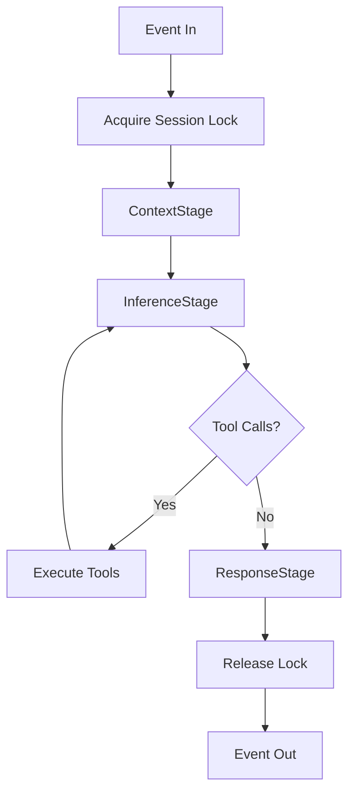
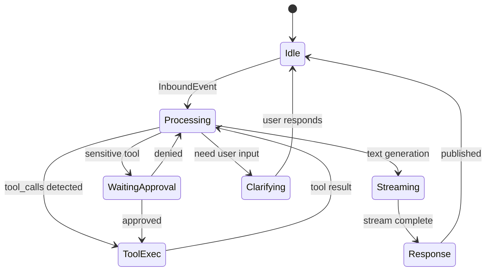
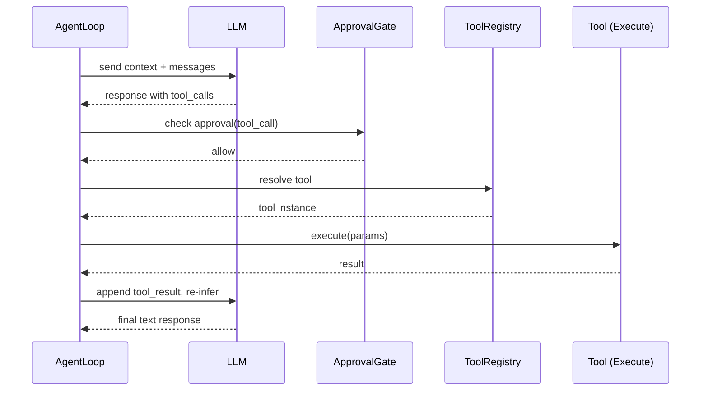

# Agent Loop

## Overview

The Agent Loop is the core processing engine of codex-pro, located in `codex_pro/agent/loop.py`. It receives inbound events from channels, assembles context, calls the LLM, iteratively executes tool calls, and sends back responses.

Each time a user message arrives, the Agent Loop completes a full **receive → assemble context → inference → tool execution → response** cycle. If the model produces tool call requests during inference, the loop iterates between InferenceStage and tool execution until a termination condition is met.

---

## Pipeline Stages

The Agent Loop splits a complete processing pass into three ordered stages:

### 1. ContextStage

ContextStage gathers all necessary information into a complete prompt:

- **Conversation History**: retrieves the current session's message list from SessionManager
- **Memory Snapshot**: loads persisted memory fragments (user preferences, project knowledge, etc.)
- **Knowledge**: retrieves knowledge base fragments relevant to the current message (via embedding similarity matching)
- **System Prompt**: assembles system instructions, safety policies, tool descriptions, etc.

When conversation history approaches the model's context window limit, ContextStage triggers the **ConversationCompressor** to summarize and compress history, preserving key information while freeing token space.

### 2. InferenceStage

InferenceStage is the heart of the loop:

- Selects an appropriate model via **ModelRouter** based on task characteristics
- Sends the request to the LLM via **InferenceController**
- Uses **TokenStreamPublisher** to stream model output in real-time to the channel
- Parses the model response to determine if it contains tool_calls
- If tool_calls are present, executes them (sequentially or concurrently), injects results into context, and calls the LLM again
- Iterates until the model no longer requests tool calls or a termination condition fires

### 3. ResponseStage

ResponseStage handles finalization:

- Packages the final response as an **OutboundEvent** and publishes it to the channel
- Handles ephemeral sessions (automatic cleanup of temporary sessions)
- Triggers **ConsolidationWorker** for background memory maintenance
- Records token consumption and cost via **CostTracker**

---

## Key Components

### ApprovalGate

ApprovalGate makes one of three decisions for each tool call:

| Decision | Meaning |
|----------|---------|
| `allow` | Execute immediately, no human confirmation needed |
| `ask` | Pause the loop, request confirmation from the user |
| `deny` | Refuse execution, return the denial reason to the model |

Decisions are based on the tool's safety classification (safe / sensitive / destructive), the current user's permissions, and session-level authorization policies.

### ToolCircuitBreaker

When a tool fails consecutively up to a threshold, the ToolCircuitBreaker marks it as "tripped." Subsequent calls return an error immediately without actual execution. This prevents the model from falling into an infinite retry loop against a failing tool.

### ToolRegistry

ToolRegistry manages registration, discovery, and filtering of all available tools:

- Filters the available tool set for the current session based on security policy
- Provides tool descriptions (schemas) for ContextStage to inject into the prompt
- Supports dynamic registration/deregistration (e.g., when MCP server connections change)

### ConversationCompressor

Triggers automatically when conversation history token count approaches the context window limit:

- Summarizes and compresses earlier conversation turns
- Retains the most recent N complete message rounds
- Preserves critical tool call results
- Recalculates the token budget after compression

### ConsolidationWorker

A background asynchronous memory maintenance task:

- Extracts information worth persisting from conversations
- Merges duplicate or conflicting memory fragments
- Cleans up expired temporary memories

### ProgressHeartbeat / SharedActivityState

Keeps the channel connection alive during long-running operations:

- **ProgressHeartbeat**: periodically sends heartbeat signals to the channel to prevent timeout disconnections
- **SharedActivityState**: shares progress state across concurrent tool executions, used to build user-visible progress indicators

### TokenStreamPublisher

Streams the LLM's token output to the channel in real-time, providing a typewriter-style response experience. Supports:

- Adapting push strategy by channel type (e.g., Slack requires batch message updates)
- Stream interruption and resumption
- Coordination with ProgressHeartbeat

### CostTracker

Tracks and enforces budget limits:

- Accumulates input/output token consumption
- Calculates costs based on model pricing rules
- Terminates the loop and notifies the user when budget is exhausted

### ModelRouter

Dynamically selects a model based on task characteristics:

- Routes simple tasks to lightweight models (reducing latency and cost)
- Routes complex reasoning tasks to high-capability models
- Supports fallback strategies (switches to alternatives when the primary model is unavailable)

---

## Iteration Control

### max_iterations

`max_iterations` is a configurable maximum iteration count that limits the number of tool-call loop cycles within a single Agent Loop run. The default value can be set in the configuration file.

### Concurrent Tool Execution

When a single inference pass produces multiple tool calls, the system partitions them by safety classification:

- **safe** tools: executed concurrently
- **sensitive / destructive** tools: executed serially, each passing through ApprovalGate individually

### Termination Conditions

The Agent Loop terminates iteration when any of the following conditions is met:

1. **No more tool calls**: the model returns a plain text response without requesting tools
2. **max_iterations reached**: iteration count exhausted
3. **External interrupt**: user sends a new message or cancels the operation
4. **Budget exhausted**: CostTracker detects token/cost limit exceeded

---

## Error Handling

### Degraded Mode

When the inference process encounters an unrecoverable error, the system enters degraded mode:

- Returns `GENERIC_FALLBACK_TEXT` as a fallback response
- Logs error details
- Notifies operations monitoring

### Embedding Circuit Breaker

The embedding service used for knowledge retrieval has its own circuit breaker:

- Threshold: `_EMBED_CIRCUIT_THRESHOLD = 3` (trips after 3 consecutive failures)
- When tripped, skips knowledge retrieval and performs inference using only conversation history and memory
- Periodically attempts recovery

### Tool Circuit Breaker Pattern

Tool circuit breaking follows the standard Circuit Breaker pattern:

```
CLOSED (normal) → consecutive failures hit threshold → OPEN (tripped) → after cooldown → HALF-OPEN (probing) → success restores CLOSED
```

---

## Session Locking

Each session acquires an `asyncio.Lock` via `SessionManager.acquire()`:

- Ensures only one Agent Loop processes a given session at any time
- Prevents state races caused by concurrent messages
- The lock is held for the entire pipeline duration (ContextStage → InferenceStage → ResponseStage)
- Guarantees lock release on exceptions (via async context manager)

---

## Diagrams

### Main Loop Flowchart



### State Diagram



### Single Iteration Sequence Diagram (with Tool Call)



---

## References

- Architecture overview: [architecture.en.md](./architecture.en.md)
- Event delivery mechanism: [events-delivery.en.md](./events-delivery.en.md)
- Source code: `codex_pro/agent/loop.py`
