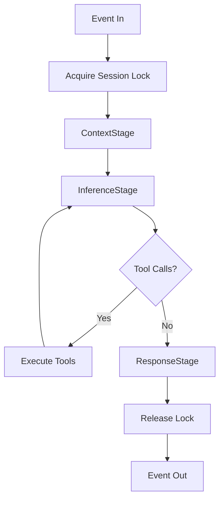
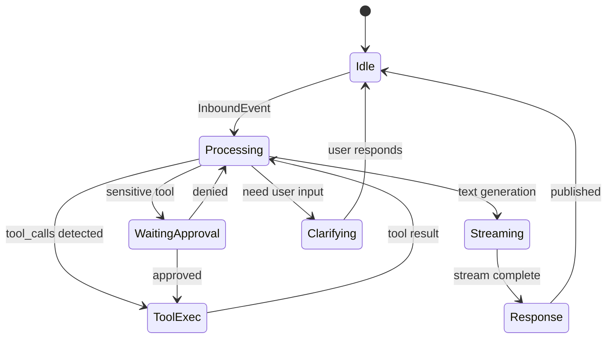
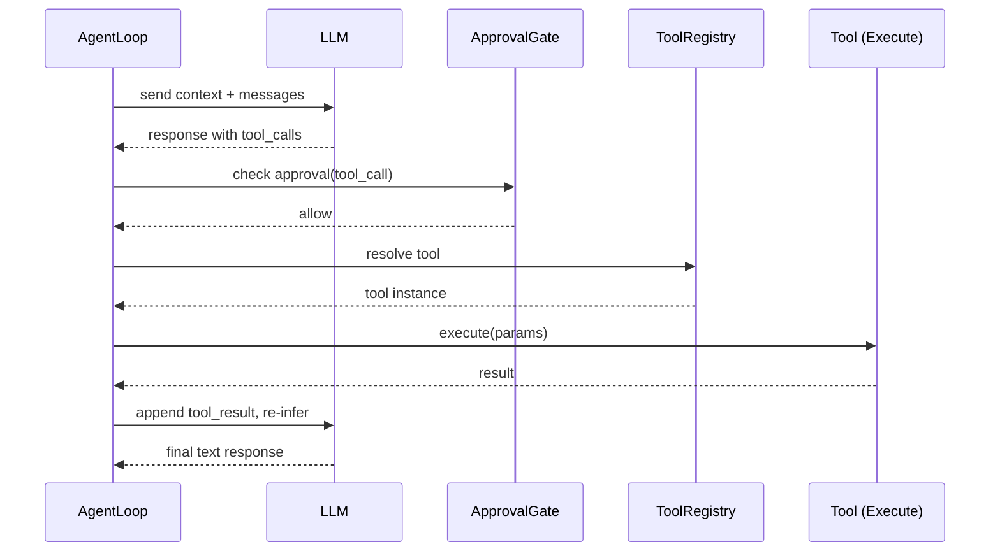

# Agent Loop（Agent 循环详解）

## 概述

Agent Loop 是 codex-pro 的核心处理引擎，位于 `codex_pro/agent/loop.py`。它负责接收来自通道的入站事件（InboundEvent），构建上下文，调用大语言模型（LLM），迭代执行工具调用，最终生成并发送响应。

每一次用户消息到达时，Agent Loop 完成一个完整的 **接收 → 组装上下文 → 推理 → 工具执行 → 响应** 循环。如果模型在推理过程中产生了工具调用请求，循环会在 InferenceStage 与工具执行之间迭代，直到满足终止条件。

---

## Pipeline 阶段

Agent Loop 将一次完整处理拆分为三个有序阶段（Stage）：

### 1. ContextStage（上下文组装）

ContextStage 负责将所有必要信息汇聚为一个完整的 prompt：

- **对话历史（Conversation History）**：从 SessionManager 获取当前会话的消息列表
- **Memory Snapshot**：加载持久化记忆片段（用户偏好、项目知识等）
- **Knowledge**：检索与当前消息相关的知识库片段（通过 Embedding 相似度匹配）
- **System Prompt**：拼接系统指令、安全策略、工具描述等

当对话历史接近模型的 context window 上限时，ContextStage 会触发 **ConversationCompressor** 对历史进行摘要压缩，保留关键信息同时释放 token 空间。

### 2. InferenceStage（推理阶段）

InferenceStage 是循环的核心：

- 通过 **ModelRouter** 根据任务特征选择合适的模型
- 通过 **InferenceController** 向 LLM 发送请求
- 使用 **TokenStreamPublisher** 将模型输出实时流式推送到通道
- 解析模型响应，判断是否包含 tool_calls
- 若存在 tool_calls，逐一（或并发）执行后，将结果注入上下文并再次调用 LLM
- 循环迭代直到模型不再请求工具调用或触发终止条件

### 3. ResponseStage（响应阶段）

ResponseStage 负责收尾工作：

- 将最终响应封装为 **OutboundEvent** 并发布到通道
- 处理 ephemeral session（临时会话自动清理）
- 触发 **ConsolidationWorker** 进行后台记忆维护
- 通过 **CostTracker** 记录本次调用的 token 消耗与费用

---

## 核心组件

### ApprovalGate（审批网关）

ApprovalGate 对每个工具调用做出三种决策之一：

| 决策 | 含义 |
|------|------|
| `allow` | 直接执行，无需人工确认 |
| `ask` | 暂停循环，向用户请求确认 |
| `deny` | 拒绝执行，返回拒绝原因给模型 |

决策依据包括工具的安全分类（safe / sensitive / destructive）、当前用户权限、以及会话级别的授权策略。

### ToolCircuitBreaker（工具熔断器）

当某个工具连续失败达到阈值时，ToolCircuitBreaker 会将该工具标记为 "熔断" 状态，后续调用直接返回错误而不实际执行。这防止模型陷入对故障工具的无限重试循环。

### ToolRegistry（工具注册表）

ToolRegistry 管理所有可用工具的注册、发现与过滤：

- 根据安全策略过滤当前会话可用的工具集
- 提供工具描述（schema）供 ContextStage 注入 prompt
- 支持动态注册/注销工具（如 MCP server 连接变更时）

### ConversationCompressor（对话压缩器）

当对话历史的 token 数接近 context window 上限时自动触发：

- 对早期对话进行摘要压缩
- 保留最近 N 轮完整消息
- 保留关键的工具调用结果
- 压缩后重新计算 token 预算

### ConsolidationWorker（记忆整合工作器）

后台异步运行的记忆维护任务：

- 从对话中提取值得持久化的信息
- 合并重复或冲突的记忆片段
- 清理过期的临时记忆

### ProgressHeartbeat / SharedActivityState（心跳与活动状态）

长时间操作时保持通道连接活跃：

- **ProgressHeartbeat**：定期向通道发送心跳信号，防止超时断连
- **SharedActivityState**：在多个并发工具执行间共享进度状态，用于构建用户可见的进度指示

### TokenStreamPublisher（流式发布器）

将 LLM 的流式 token 输出实时推送到通道，实现打字机效果的响应体验。支持：

- 按通道类型适配推送策略（如 Slack 需要批量更新消息）
- 流中断与恢复
- 与 ProgressHeartbeat 协同工作

### CostTracker（成本追踪器）

跟踪并强制执行预算限制：

- 累计 input/output token 消耗
- 按模型计价规则计算费用
- 当预算耗尽时终止循环并通知用户

### ModelRouter（模型路由器）

根据任务特征动态选择模型：

- 简单任务路由到轻量模型（降低延迟与成本）
- 复杂推理任务路由到高能力模型
- 支持 fallback 策略（主模型不可用时切换备选）

---

## 迭代控制

### max_iterations

`max_iterations` 是可配置的最大迭代次数，限制单次 Agent Loop 中工具调用的循环次数。默认值可在配置文件中设定。

### 并发工具执行

当一次推理产生多个工具调用时，系统按安全分类进行分区：

- **safe** 类工具：可并发执行
- **sensitive / destructive** 类工具：串行执行，逐一通过 ApprovalGate

### 终止条件

Agent Loop 在以下任一条件满足时终止迭代：

1. **无更多工具调用**：模型返回纯文本响应，不再请求工具
2. **达到 max_iterations**：迭代次数耗尽
3. **外部中断**：用户发送新消息或取消操作
4. **预算耗尽**：CostTracker 检测到 token/费用超限

---

## 错误处理

### Degraded Mode（降级模式）

当推理过程遇到不可恢复的错误时，系统进入降级模式：

- 返回 `GENERIC_FALLBACK_TEXT` 作为兜底响应
- 记录错误详情到日志
- 通知运维监控

### Embedding Circuit Breaker

知识检索使用的 Embedding 服务有独立的熔断机制：

- 阈值：`_EMBED_CIRCUIT_THRESHOLD = 3`（连续 3 次失败触发熔断）
- 熔断后跳过知识检索，仅使用对话历史和记忆进行推理
- 定期尝试恢复

### Tool Circuit Breaker Pattern

工具熔断遵循标准的 Circuit Breaker 模式：

```
CLOSED（正常）→ 连续失败达阈值 → OPEN（熔断）→ 冷却期后 → HALF-OPEN（试探）→ 成功则恢复 CLOSED
```

---

## Session Locking（会话锁）

每个会话（Session）通过 `SessionManager.acquire()` 获取一个 `asyncio.Lock`：

- 确保同一会话同一时刻只有一个 Agent Loop 在处理
- 防止并发消息导致的状态竞争
- 锁在整个 Pipeline（ContextStage → InferenceStage → ResponseStage）期间持有
- 异常时确保锁释放（通过 async context manager）

---

## 流程图

### 主循环流程



### 状态图



### 单次迭代时序图（含工具调用）



---

## 参考

- 架构总览：[architecture.md](./architecture.md)
- 事件投递机制：[events-delivery.md](./events-delivery.md)
- 源码：`codex_pro/agent/loop.py`
