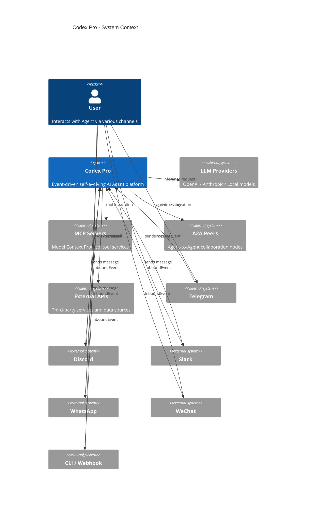
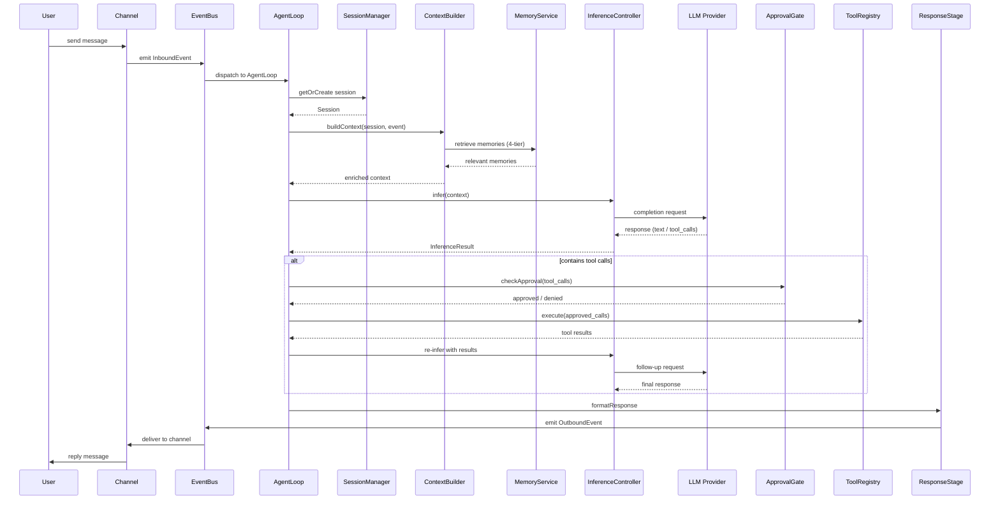
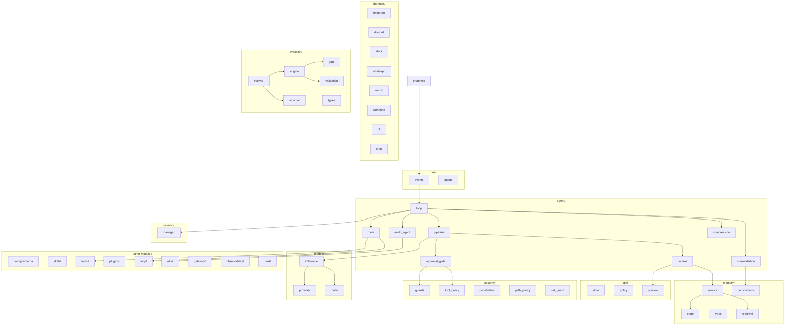

# Architecture Overview

Codex Pro uses an event-driven, channel-agnostic architecture built around a unified
AgentLoop. The same inference and tool execution logic serves Telegram, Discord, Slack,
WhatsApp, WeChat, CLI, Webhook, and other channel integrations.

## System Context Diagram (C4 Style)

## Message Sequence Diagram

## Module Relationship Diagram

## Core Architectural Principles

| Principle | Description |
|-----------|-------------|
| Event-driven | All I/O normalized to InboundEvent / OutboundEvent, decoupled via EventBus |
| Channel-agnostic core | AgentLoop is fully decoupled from channel implementations; same logic handles messages from any source |
| Pipeline stages | Processing pipeline divided into ContextStage -> InferenceStage -> ResponseStage |
| Security-by-default | ToolPolicy filtering, ShellGuard sandboxing, ApprovalGate human-in-the-loop review |
| Memory-augmented | 4-tier memory (working / episodic / semantic / procedural) injected into every context build |
| Self-evolving | Trajectory capture and evolution engine enable autonomous skill improvement |
