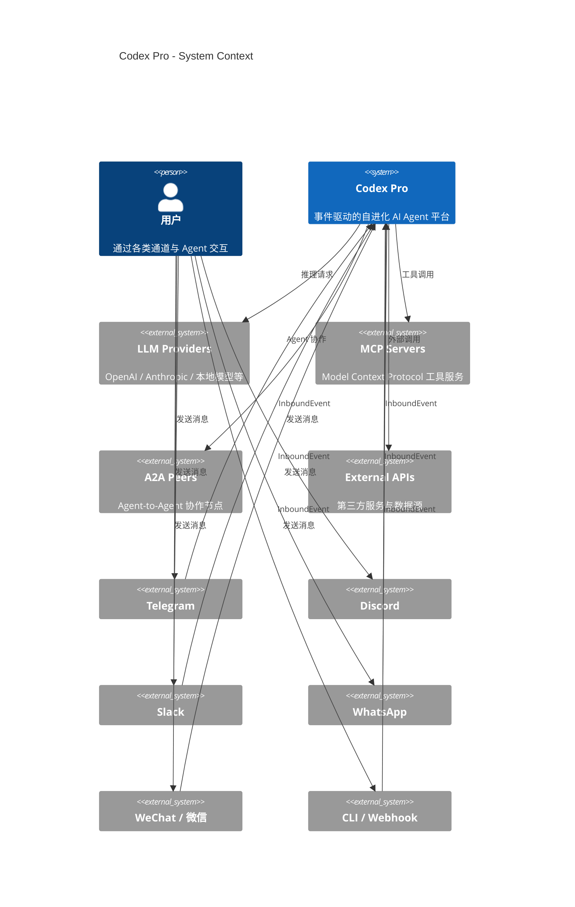
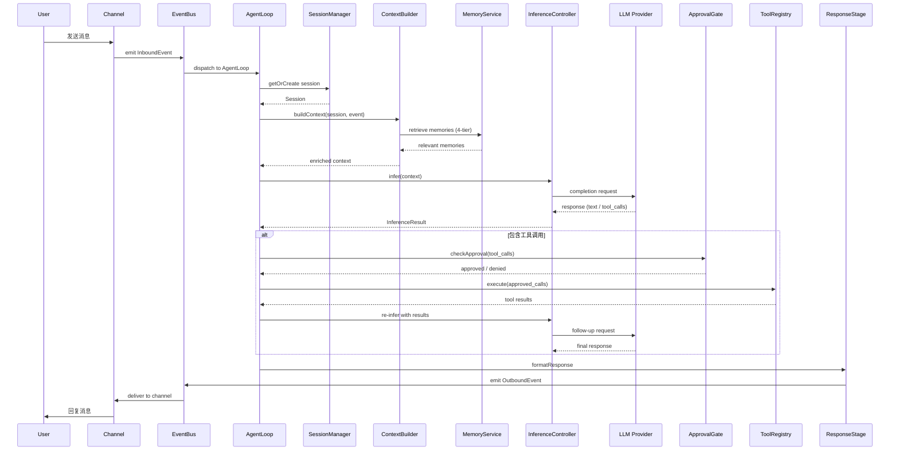
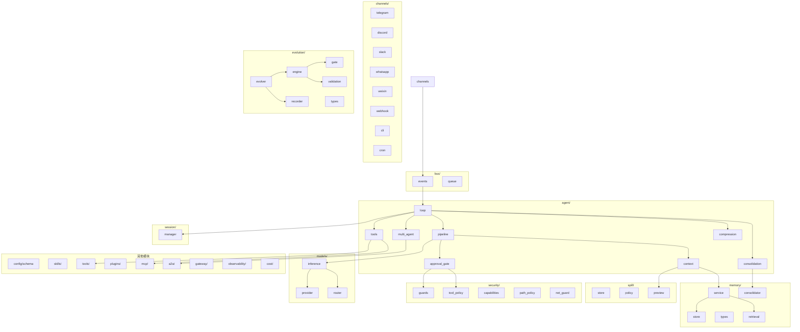

# 架构概览

Codex Pro 采用事件驱动、通道无关的架构设计，围绕统一的 AgentLoop 构建，
使同一套推理与工具执行逻辑能够服务于 Telegram、Discord、Slack、WhatsApp、
微信、CLI、Webhook 等多种接入方式。

## 系统上下文图 (C4 Style)

## 消息处理时序图

## 模块关系图

## 核心架构原则

| 原则 | 说明 |
|------|------|
| Event-driven | 所有 I/O 统一为 InboundEvent / OutboundEvent，通过 EventBus 解耦 |
| Channel-agnostic core | AgentLoop 与通道实现完全解耦，同一套逻辑处理任何来源的消息 |
| Pipeline stages | 处理流水线分为 ContextStage -> InferenceStage -> ResponseStage 三阶段 |
| Security-by-default | ToolPolicy 过滤、ShellGuard 沙箱、ApprovalGate 人机协作审批 |
| Memory-augmented | 4-tier memory (working / episodic / semantic / procedural) 注入每次 context 构建 |
| Self-evolving | 通过 trajectory 捕获与 evolution engine 实现自主技能改进 |
