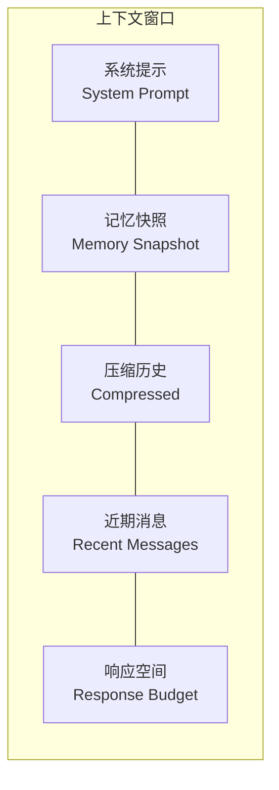

# 上下文压缩与 Spill

LLM 的上下文窗口是有限的。当对话变长或工具输出过大时，需要主动管理上下文以避免截断。Codex Pro 通过两个互补机制解决此问题：**对话压缩**（缩减历史）和 **Spill 溢出**（落盘大输出）。

## 上下文窗口布局

各区段竞争有限的 token 预算。压缩与 Spill 的目标是在保留关键信息的前提下，为近期消息和响应留出足够空间。

## 1. 对话压缩 ConversationCompressor

### 触发时机

当消息历史接近模型上下文窗口限制时自动触发（由 `compression_window()` 和 `resolve_context_window()` 计算阈值）。

### 工作原理

1. 从 `Session.last_consolidated` 指针之前的消息中选取待压缩部分
2. 将旧消息合并为摘要，保留关键事实和决策
3. 更新 `last_consolidated` 指针
4. `get_history(max_messages=500)` 仅返回未压缩部分

### 历史对齐规则

- 永远不以孤立的 `tool` 结果消息开头（跳过其 paired assistant 已被压缩的 tool results）
- 确保从 `user` 消息边界开始返回
