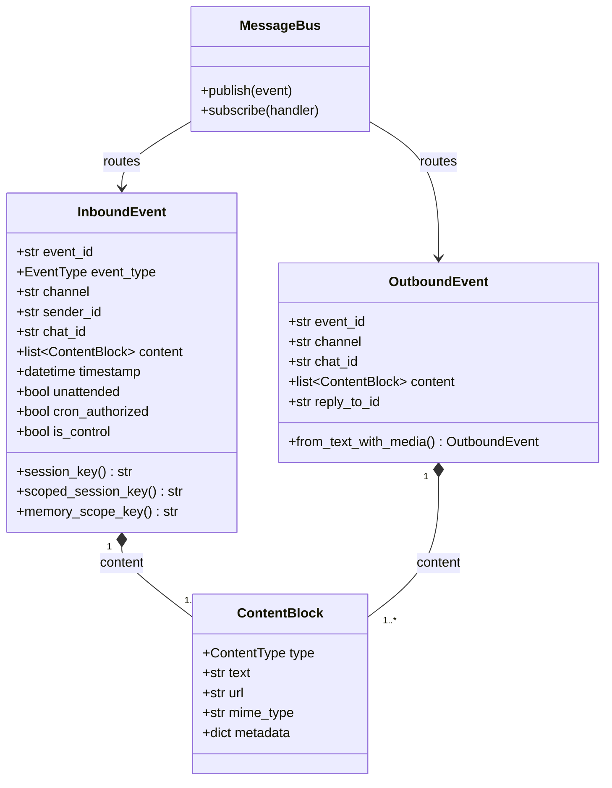
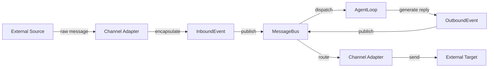

# Events and Delivery

## Overview

codex-pro's message processing is built on an **event-driven architecture**. All external inputs (user messages, webhook callbacks, scheduled tasks, etc.) are uniformly encapsulated as `InboundEvent`, dispatched through the `MessageBus` to the AgentLoop for processing, and the resulting replies are encapsulated as `OutboundEvent` and delivered back to the target channel via the MessageBus.

## Core Types

### EventType Enum

| Value | Description |
|---|---|
| `MESSAGE` | User message from an IM channel |
| `WEBHOOK` | External webhook callback |
| `CRON` | Scheduled task trigger |
| `CLI` | Command-line input |
| `SYSTEM` | Internal system event |

### ContentType Enum

| Value | Description |
|---|---|
| `TEXT` | Plain text |
| `IMAGE` | Image |
| `FILE` | File |
| `AUDIO` | Audio |
| `VIDEO` | Video |
| `VOICE` | Voice message |
| `MIXED` | Mixed content |

## Data Model

### ContentBlock

A content block is the smallest payload unit of a message:

| Field | Description |
|---|---|
| `type` | ContentType enum value |
| `text` | Text content (for TEXT type) |
| `url` | Media resource URL |
| `mime_type` | MIME type identifier |
| `metadata` | Additional metadata dict |

### InboundEvent

| Field | Description |
|---|---|
| `event_id` | UUID hex 16-character identifier |
| `event_type` | EventType enum |
| `channel` | Source channel identifier |
| `sender_id` | Sender ID |
| `chat_id` | Chat/conversation ID |
| `content` | `list[ContentBlock]` content list |
| `timestamp` | Event timestamp |
| `reply_to_id` | Quoted message ID |
| `reply_to_text` | Quoted message text |
| `reply_to_sender` | Sender of the quoted message |
| `reply_to_is_own` | Whether the quoted message was sent by self |
| `thread_id` | Thread ID |
| `session_key_override` | Session key override value |
| `memory_scope` | Memory isolation scope |
| `metadata` | General metadata dict |
| `gateway_metadata` | Gateway-level metadata |
| `is_group` | Whether this is a group chat message |

**Trust signal fields (first-class typed fields):**

| Field | Description |
|---|---|
| `unattended` | Unattended mode flag |
| `cron_authorized` | Cron task authorization flag |
| `is_control` | Control command flag |

### OutboundEvent

| Field | Description |
|---|---|
| `event_id` | Event identifier |
| `channel` | Target channel |
| `chat_id` | Target chat/conversation |
| `content` | `list[ContentBlock]` content list |
| `reply_to_id` | Reply target message ID |
| `thread_id` | Thread ID |
| `metadata` | Metadata dict |

`OutboundEvent` provides the `from_text_with_media()` factory method, which parses media tags in text and automatically splits them into multiple ContentBlocks.

## Session Routing

InboundEvent provides three key computation methods:

- **`session_key`** property: defaults to `f"{channel}:{chat_id}"`, overridable via `session_key_override`
- **`scoped_session_key()`**: incorporates `sender_id` into the key when `per_user` isolation is enabled in group chats
- **`memory_scope_key()`**: independent of session_key, defines the isolation boundary for memory storage

## Data Model Diagram

## Delivery Flow

**Flow description:**

1. External message sources (IM, Webhook, CLI, etc.) send raw requests to the corresponding Channel Adapter
2. The Channel Adapter normalizes raw data into an `InboundEvent` and publishes it to the MessageBus
3. The MessageBus dispatches the event to the AgentLoop based on subscriptions
4. The AgentLoop processes the event and produces an `OutboundEvent`, publishing it back to the MessageBus
5. The MessageBus routes the outbound event to the target Channel Adapter
6. The Channel Adapter converts the content to the platform's format and sends it to the external target

## Security Design: Trust Signals

The three trust signals `unattended`, `cron_authorized`, and `is_control` are designed as **first-class typed fields** on the dataclass, rather than being stored in the `metadata` dict. This is a deliberate security decision:

- The `metadata` dict contents originate from raw data passed in by external channels
- If trust signals were placed in metadata, malicious users could forge these fields via payload injection
- By elevating them to typed fields on the dataclass, only trusted internal producers (scheduler, delivery modules) can set these values
- Channel adapters do not and should not set these fields when constructing an InboundEvent
