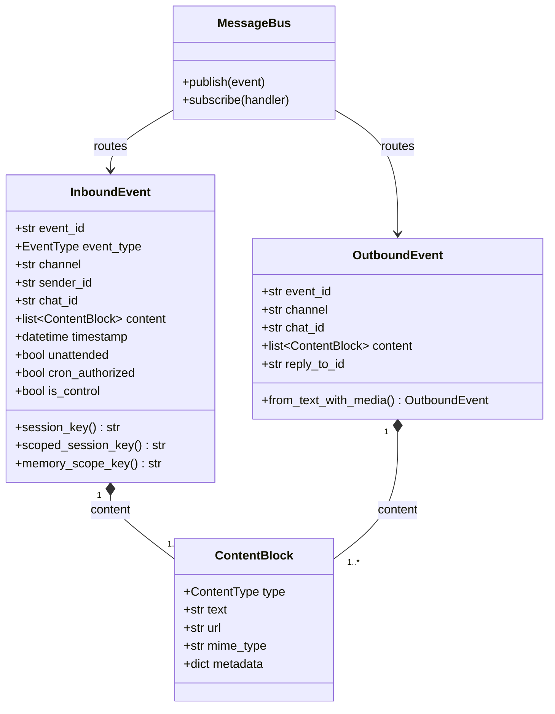
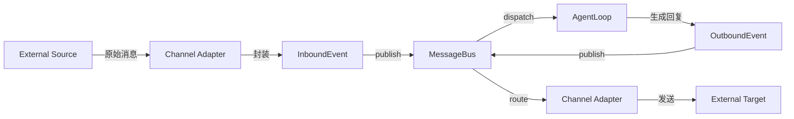

# 事件与投递机制

## 概述

codex-pro 的消息处理建立在 **事件驱动架构** 之上。所有外部输入（用户消息、Webhook 回调、定时任务等）统一封装为 `InboundEvent`，经过 `MessageBus` 分发给 AgentLoop 处理，产生的回复封装为 `OutboundEvent` 再经由 MessageBus 投递回目标通道。

## 核心类型

### EventType 枚举

| 值 | 含义 |
|---|---|
| `MESSAGE` | 用户消息（来自 IM 通道） |
| `WEBHOOK` | 外部 Webhook 回调 |
| `CRON` | 定时任务触发 |
| `CLI` | 命令行输入 |
| `SYSTEM` | 系统内部事件 |

### ContentType 枚举

| 值 | 含义 |
|---|---|
| `TEXT` | 纯文本 |
| `IMAGE` | 图片 |
| `FILE` | 文件 |
| `AUDIO` | 音频 |
| `VIDEO` | 视频 |
| `VOICE` | 语音 |
| `MIXED` | 混合内容 |

## 数据模型

### ContentBlock

内容块是消息的最小载荷单元：

| 字段 | 说明 |
|---|---|
| `type` | ContentType 枚举值 |
| `text` | 文本内容（TEXT 类型时） |
| `url` | 媒体资源地址 |
| `mime_type` | MIME 类型标识 |
| `metadata` | 附加元数据 dict |

### InboundEvent（入站事件）

| 字段 | 说明 |
|---|---|
| `event_id` | uuid hex 16 位标识 |
| `event_type` | EventType 枚举 |
| `channel` | 来源通道标识 |
| `sender_id` | 发送者 ID |
| `chat_id` | 会话 ID |
| `content` | `list[ContentBlock]` 内容列表 |
| `timestamp` | 事件时间戳 |
| `reply_to_id` | 引用消息 ID |
| `reply_to_text` | 引用消息文本 |
| `reply_to_sender` | 被引用消息的发送者 |
| `reply_to_is_own` | 被引用消息是否为自身发出 |
| `thread_id` | 话题/线程 ID |
| `session_key_override` | 会话 key 覆盖值 |
| `memory_scope` | 记忆隔离范围 |
| `metadata` | 通用元数据 dict |
| `gateway_metadata` | 网关层元数据 |
| `is_group` | 是否群聊消息 |

**信任信号字段（一等公民 typed fields）：**

| 字段 | 说明 |
|---|---|
| `unattended` | 无人值守模式标记 |
| `cron_authorized` | 定时任务授权标记 |
| `is_control` | 控制指令标记 |

### OutboundEvent（出站事件）

| 字段 | 说明 |
|---|---|
| `event_id` | 事件标识 |
| `channel` | 目标通道 |
| `chat_id` | 目标会话 |
| `content` | `list[ContentBlock]` 内容列表 |
| `reply_to_id` | 回复目标消息 ID |
| `thread_id` | 话题/线程 ID |
| `metadata` | 元数据 dict |

`OutboundEvent` 提供 `from_text_with_media()` 工厂方法，支持解析文本中的媒体标签并自动拆分为多个 ContentBlock。

## 会话路由

InboundEvent 提供三种 key 计算方式：

- **`session_key`** 属性：默认为 `f"{channel}:{chat_id}"`，可通过 `session_key_override` 覆盖
- **`scoped_session_key()`**：在群聊中启用 `per_user` 隔离时，将 `sender_id` 纳入 key
- **`memory_scope_key()`**：独立于 session_key，用于记忆存储的隔离边界

## 数据模型关系图

## 投递流程

**流程说明：**

1. 外部消息源（IM、Webhook、CLI 等）将原始请求发送到对应的 Channel Adapter
2. Channel Adapter 将原始数据标准化为 `InboundEvent`，写入 MessageBus
3. MessageBus 根据订阅关系将事件分发给 AgentLoop
4. AgentLoop 处理事件，生成 `OutboundEvent` 回写 MessageBus
5. MessageBus 将出站事件路由到目标 Channel Adapter
6. Channel Adapter 将内容转换为平台格式并发送到外部目标

## 安全设计：信任信号

`unattended`、`cron_authorized`、`is_control` 这三个信任信号被设计为 **一等公民 typed fields**，而非存放在 `metadata` dict 中。这是一个刻意的安全决策：

- `metadata` dict 的内容来源于外部通道传入的原始数据
- 如果信任信号放在 metadata 中，恶意用户可通过 payload injection 伪造这些字段
- 将其提升为 dataclass 的 typed fields 后，只有受信任的内部生产者（scheduler、delivery 模块）才能设置这些值
- 外部通道适配器在构造 InboundEvent 时不会也不应设置这些字段
