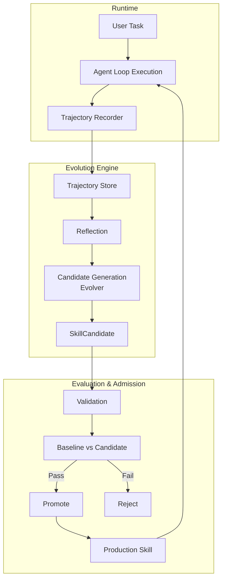
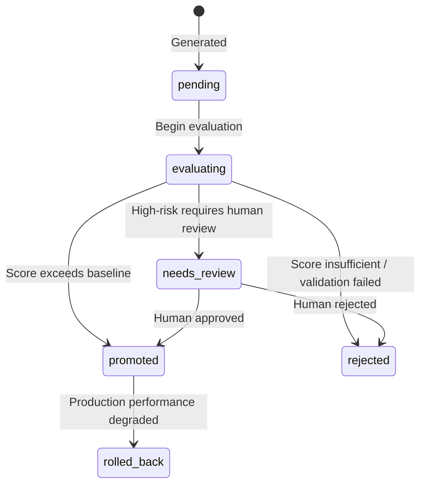

# Evolution & Evaluation

Codex Pro has self-evolution capabilities: it captures interaction trajectories, reflects on execution quality, automatically generates skill candidates, and promotes them to production skills after evaluation. This forms a closed loop that enables continuous improvement during operation.

## Evolution Loop Overview



## 1. Trajectory Capture

After each user task completes, the `Recorder` captures the full execution trajectory:

```python
@dataclass
class Trajectory:
    id: str                          # traj_xxxxxxxxxxxx
    session_id: str
    channel: str
    task_input: str                   # Original user input
    task_type: str                    # Task type classification
    tools_called: list[ToolCall]      # Tool call chain
    iterations: int                   # Loop iterations
    duration_ms: float
    final_response: str
    reflection_score: float | None    # Reflection score
    reflection_critique: str          # Reflection commentary
    reflection_suggestions: list[str] # Improvement suggestions
    outcome: "success" | "failure" | "partial"
    skills_active: list[str]          # Skills active at time
    model_used: str
```

`ToolCall` records a summary of each tool invocation (arguments/results are redacted via `digest()`, retaining only the first 200 chars + a SHA-256 prefix):

```python
@dataclass
class ToolCall:
    name: str
    args_digest: str       # Redacted summary
    result_digest: str     # Redacted summary
    duration_ms: float
    success: bool
    error: str
```

## 2. Reflection

After trajectory recording, the engine performs self-evaluation of execution quality:

- `reflection_score`: 0-1 value measuring task completion quality
- `reflection_critique`: Commentary on current strategy
- `reflection_suggestions`: Specific improvement suggestions

Reflection results are stored in the trajectory for subsequent candidate generation.

## 3. Candidate Generation (Evolver)

The `Evolver` analyzes accumulated trajectories, identifies recurring patterns and improvement opportunities, and generates skill candidates:

```python
@dataclass
class SkillCandidate:
    id: str                    # cand_xxxxxxxxxxxx
    operation: "create" | "patch" | "disable" | "delete"
    skill_id: str | None       # Target skill (non-null for patch/disable/delete)
    name: str
    description: str
    content: str               # SKILL.md content
    source: "evolver" | "reviewer" | "manual"
    risk: "low" | "high"
    status: "pending" | "evaluating" | "promoted" | "rejected" | "rolled_back" | "needs_review"
    trajectory_ids: list[str]  # Associated trajectory IDs
    baseline_score: float | None
    candidate_score: float | None
    rejection_reason: str
```

## 4. Candidate State Transitions



## 5. Skill Admission Process

### Risk Grading

- `low`: Pure knowledge/prompt skills, no side effects
- `high`: Skills involving tool calls or external interactions

### Validation Pipeline

`validation.py` performs admission checks:

1. **Injection scan**: Detects prompt injection patterns in skill content
2. **Format validation**: Ensures SKILL.md structure compliance
3. **Dependency check**: Verifies declared tools/resources are available

### Evaluation Comparison

- Selects relevant trajectories to construct test cases
- Performs A/B evaluation between baseline (current skill set) and candidate (new skill set)
- Compares `baseline_score` vs `candidate_score`

### Admission Gate

`gate.py` controls the final decision:

- Low risk + score exceeds baseline → automatic promotion
- High risk → enters `needs_review` awaiting human review
- Score insufficient → automatic rejection with `rejection_reason` logged

## 6. Evolution Run Record

```python
@dataclass
class EvolutionRun:
    id: str                       # run_xxxxxxxxxxxx
    triggered_by: "manual" | "threshold" | "scheduled"
    trajectories_consumed: int
    candidates_generated: int
    candidates_promoted: int
    candidates_rejected: int
    candidates_needs_review: int
    duration_ms: float
    started_at: str
    finished_at: str
    error: str
```

## 7. Trigger Modes

| Trigger | Description |
|---------|-------------|
| `manual` | Operator manually initiates |
| `threshold` | Auto-triggers when accumulated trajectories reach threshold |
| `scheduled` | Periodic scheduling (`scheduler.py`) |

## 8. Rollback Mechanism

A skill that degrades in production after promotion can be reverted to its pre-change version, moving the candidate to `rolled_back`.

Rollback is **manual only**; there is no automatic trigger driven by runtime metrics, so the system never decides on its own that a promoted skill has degraded. To roll one back:

```bash
codex-pro evolution rollback <skill-name>
```

Restoration takes one of two paths. For content-change candidates, the recorded patch is applied in reverse; if that fails, it falls back to the skill-directory snapshot retained at promotion time under `.evolution_backups/<candidate-id>/`. For disable candidates, the skill is simply re-enabled. If both paths fail, the rollback reports an error and leaves everything as it was rather than stopping halfway.
