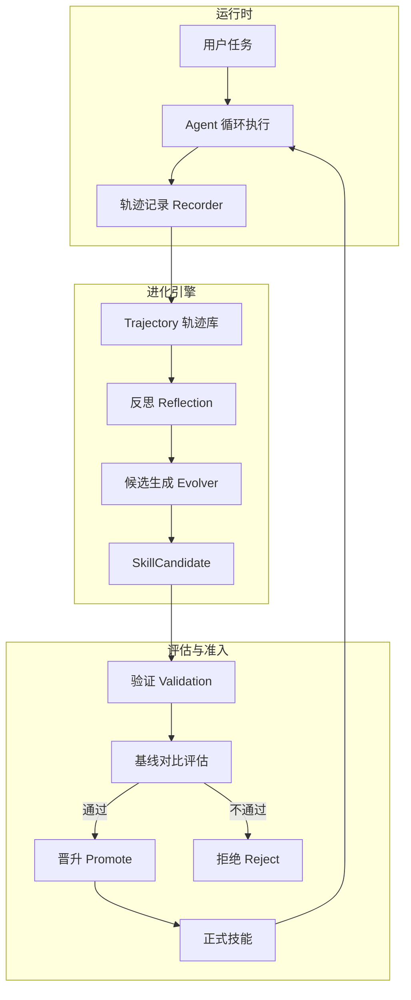
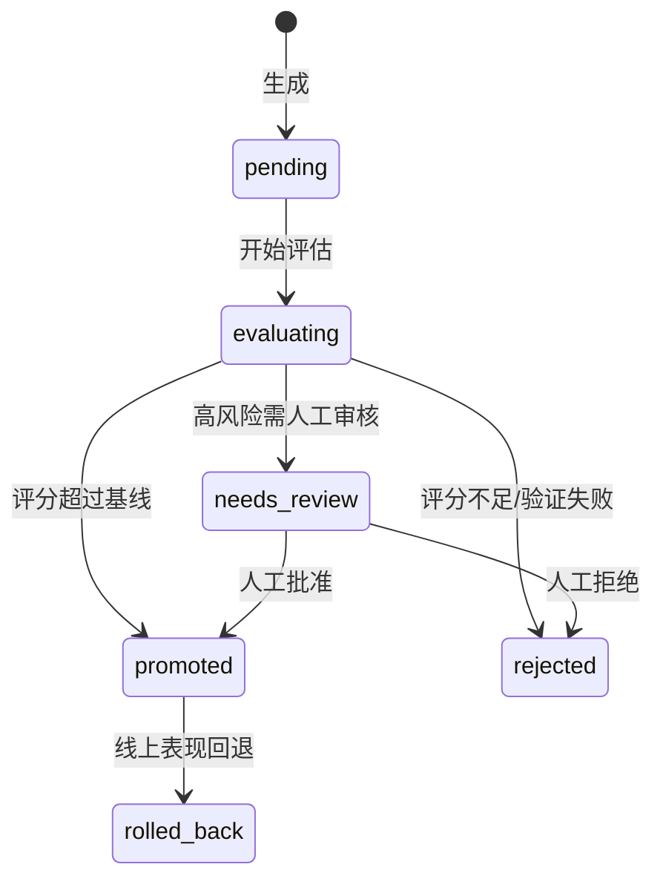

# 进化与评估

Codex Pro 具备自进化能力：通过捕获交互轨迹、反思执行质量、自动生成技能候选，再经评估验证后晋升为正式技能。整个流程形成闭环，使 Agent 在运行中持续改进。

## 进化闭环总览



## 1. 轨迹捕获 Trajectory

每次用户任务完成后，`Recorder` 记录完整执行轨迹：

```python
@dataclass
class Trajectory:
    id: str                          # traj_xxxxxxxxxxxx
    session_id: str
    channel: str
    task_input: str                   # 用户原始输入
    task_type: str                    # 任务类型分类
    tools_called: list[ToolCall]      # 工具调用链
    iterations: int                   # 循环次数
    duration_ms: float
    final_response: str
    reflection_score: float | None    # 反思评分
    reflection_critique: str          # 反思评语
    reflection_suggestions: list[str] # 改进建议
    outcome: "success" | "failure" | "partial"
    skills_active: list[str]          # 当时激活的技能
    model_used: str
```

`ToolCall` 记录单次工具调用的摘要（参数/结果经 `digest()` 脱敏，仅保留前 200 字符 + SHA-256 前缀）：

```python
@dataclass
class ToolCall:
    name: str
    args_digest: str       # 脱敏摘要
    result_digest: str     # 脱敏摘要
    duration_ms: float
    success: bool
    error: str
```

## 2. 反思 Reflection

轨迹记录后，引擎对执行质量做自我评估：

- `reflection_score`：0-1 分值，衡量任务完成度
- `reflection_critique`：对当前策略的评语
- `reflection_suggestions`：具体改进建议列表

反思结果存储在轨迹中，供后续候选生成参考。

## 3. 候选生成 Evolver

`Evolver` 分析累积轨迹，识别重复模式与改进机会，生成技能候选：

```python
@dataclass
class SkillCandidate:
    id: str                    # cand_xxxxxxxxxxxx
    operation: "create" | "patch" | "disable" | "delete"
    skill_id: str | None       # 目标技能（patch/disable/delete 时非空）
    name: str
    description: str
    content: str               # SKILL.md 内容
    source: "evolver" | "reviewer" | "manual"
    risk: "low" | "high"
    status: "pending" | "evaluating" | "promoted" | "rejected" | "rolled_back" | "needs_review"
    trajectory_ids: list[str]  # 关联的轨迹 ID
    baseline_score: float | None
    candidate_score: float | None
    rejection_reason: str
```

## 4. 候选状态流转



## 5. 技能准入流程

### 风险分级 Risk Grading

- `low`：纯知识/提示词技能，无副作用
- `high`：涉及工具调用、外部交互的技能

### 验证管线 Validation

`validation.py` 执行准入检查：

1. **注入扫描**：检测技能内容中的 prompt injection 模式
2. **格式验证**：确保 SKILL.md 结构合规
3. **依赖检查**：验证技能声明的工具/资源可用

### 评估对比 Evaluation

- 选取相关轨迹构造测试用例
- 在基线（当前技能集）和候选（新技能集）之间做 A/B 评估
- 比较 `baseline_score` vs `candidate_score`

### 准入门 Gate

`gate.py` 控制最终决策：

- 低风险 + 评分超过基线 → 自动晋升
- 高风险 → 进入 `needs_review` 等待人工
- 评分不足 → 自动拒绝并记录 `rejection_reason`

## 6. 进化运行记录 EvolutionRun

```python
@dataclass
class EvolutionRun:
    id: str                       # run_xxxxxxxxxxxx
    triggered_by: "manual" | "threshold" | "scheduled"
    trajectories_consumed: int
    candidates_generated: int
    candidates_promoted: int
    candidates_rejected: int
    candidates_needs_review: int
    duration_ms: float
    started_at: str
    finished_at: str
    error: str
```

## 7. 触发方式

| 触发器 | 说明 |
|--------|------|
| `manual` | 运维人员手动触发 |
| `threshold` | 累积轨迹达到阈值自动触发 |
| `scheduled` | 定时调度（`scheduler.py`） |

## 8. 回滚机制

晋升后的技能如果线上表现恶化，可回滚到变更前的版本，候选状态转为 `rolled_back`。

回滚**只有手动入口**，没有基于运行时指标的自动触发：系统不会自行判定「表现恶化」并撤销已晋升的技能。执行回滚用：

```bash
codex-pro evolution rollback <技能名>
```

恢复分两条路径。对内容变更类候选，用记录的补丁做反向应用；反向补丁失败时，退回到晋升时保留的技能目录快照（存放在 `.evolution_backups/<候选 id>/`）。对禁用类候选，重新启用该技能即可。两条路径都失败时回滚报错并保持原状，不会留下半成品状态。
