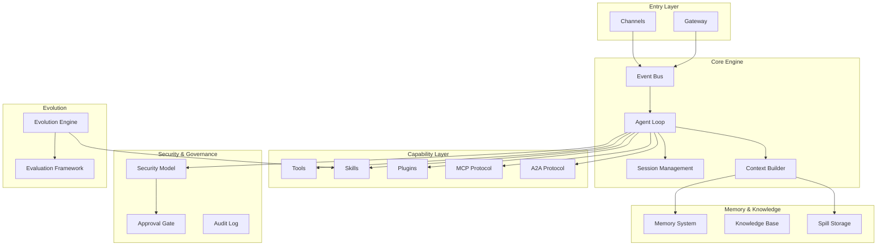

# Concepts Overview

Codex Pro is a multi-channel AI agent framework built around an event-driven conversation loop. This section introduces the core concepts and their relationships.

## Concept Map

## Concept Index

| Concept | Description | Document |
|---------|-------------|----------|
| Architecture Overview | System context, module relationships, message sequences | [architecture.en.md](architecture.en.md) |
| Agent Loop | Complete processing flow from event reception to response delivery | [agent-loop.en.md](agent-loop.en.md) |
| Events & Delivery | InboundEvent / OutboundEvent data model and delivery guarantees | [events-delivery.en.md](events-delivery.en.md) |
| Workspace, Session & Identity | Session key composition, scope isolation, identity binding | [workspace-session-identity.en.md](workspace-session-identity.en.md) |
| Memory System | Four-tier memory architecture, retrieval, decay, consolidation | [memory-system.en.md](memory-system.en.md) |
| Context Compression & Spill | Window management, tool output spillover, on-demand retrieval | [context-compression-spill.en.md](context-compression-spill.en.md) |
| Skills, Tools & Plugins | Capability abstraction comparison: Tool / Skill / Plugin / MCP / A2A | [skills-tools-plugins.en.md](skills-tools-plugins.en.md) |
| Security Model | Three security profiles, four tool profiles, path/network policy | [security-model.en.md](security-model.en.md) |
| Evolution & Evaluation | Trajectory capture, reflection, candidate generation, evaluation, promotion | [evolution-evaluation.en.md](evolution-evaluation.en.md) |
| Multi-Agent Collaboration | Delegate tool, worker model, concurrent execution | [multi-agent.en.md](multi-agent.en.md) |

## Reading Guide

- **Quick start**: Read [Architecture Overview](architecture.en.md) for the big picture, then drill into subtopics as needed
- **Operators**: Focus on [Security Model](security-model.en.md) and [Workspace, Session & Identity](workspace-session-identity.en.md)
- **Extension developers**: Start with [Skills, Tools & Plugins](skills-tools-plugins.en.md), paired with [Evolution & Evaluation](evolution-evaluation.en.md)
- **Contributors**: [Agent Loop](agent-loop.en.md) + [Events & Delivery](events-delivery.en.md) are key to understanding the code structure
