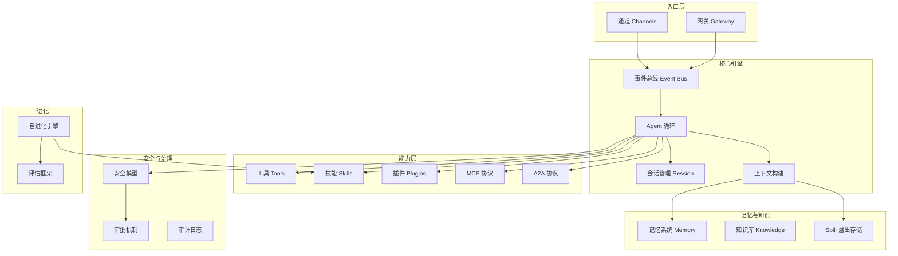

# 概念总览

Codex Pro 是一个多通道 AI 代理框架，围绕「事件驱动的对话循环」构建。本节介绍框架的核心概念及其相互关系。

## 概念地图

## 概念索引

| 概念 | 说明 | 文档 |
|------|------|------|
| 架构总览 | 系统上下文、模块关系、消息时序 | [architecture.md](architecture.md) |
| Agent 循环 | 从事件接收到响应发送的完整处理流程 | [agent-loop.md](agent-loop.md) |
| 事件与投递 | InboundEvent / OutboundEvent 数据模型与投递保证 | [events-delivery.md](events-delivery.md) |
| 工作区、会话与身份 | session key 构成、作用域隔离、身份绑定 | [workspace-session-identity.md](workspace-session-identity.md) |
| 记忆系统 | 四层记忆架构、检索、衰减、合并 | [memory-system.md](memory-system.md) |
| 上下文压缩与 Spill | 窗口管理、工具输出溢出、按需取回 | [context-compression-spill.md](context-compression-spill.md) |
| Skill、Tool 与 Plugin | 能力抽象对比：Tool / Skill / Plugin / MCP / A2A | [skills-tools-plugins.md](skills-tools-plugins.md) |
| 安全模型 | 三级安全档位、四级工具档位、路径/网络策略 | [security-model.md](security-model.md) |
| 进化与评估 | 轨迹捕获、反思、候选生成、评估、晋升 | [evolution-evaluation.md](evolution-evaluation.md) |
| 多 Agent 协作 | delegate 工具、Worker 模型、并发执行 | [multi-agent.md](multi-agent.md) |

## 阅读建议

- **快速入门**：先读[架构总览](architecture.md)建立全局视角，再按需深入各子主题
- **部署者**：重点关注[安全模型](security-model.md)和[工作区、会话与身份](workspace-session-identity.md)
- **扩展开发者**：从 [Skill、Tool 与 Plugin](skills-tools-plugins.md) 开始，配合[进化与评估](evolution-evaluation.md)
- **贡献者**：[Agent 循环](agent-loop.md) + [事件与投递](events-delivery.md) 是理解代码结构的关键
