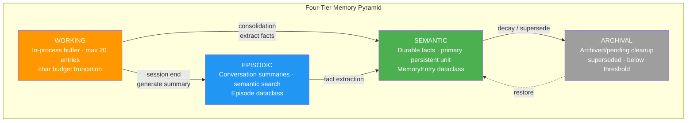
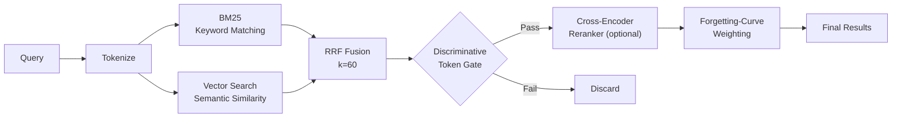
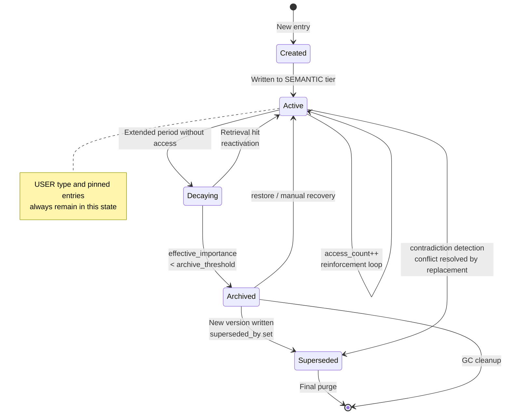

# Memory System Deep Dive

## Overview

Codex Pro's Memory System employs a biologically-inspired design that mirrors the multi-tiered structure of human cognition. Information is distributed across four tiers based on recency, importance, and access frequency. Hybrid retrieval ensures efficient recall, while Ebbinghaus-based decay maintains a high signal-to-noise ratio in the prompt context window.

---

## Four-Tier Architecture

The memory system comprises four tiers, ordered from high-frequency ephemeral to low-frequency durable:

| Tier | Purpose | Storage Characteristics | Lifecycle |
|------|---------|------------------------|-----------|
| **WORKING** | In-process buffer | Max 20 entries, rendered as markdown for prompt injection | Single session |
| **EPISODIC** | Conversation summaries | Episode objects, semantic search via embeddings | Cross-session, retained by importance |
| **SEMANTIC** | Durable facts | Primary persistent unit (MemoryEntry dataclass) | Long-term, subject to decay |
| **ARCHIVAL** | Archived/pending cleanup | Entries with superseded_by set or below archive threshold | Recoverable, eventually purged |

### WORKING Tier

- In-process ring buffer with a hard cap of **20 entries**
- Rendered to markdown and injected into the system message on each prompt build
- Subject to a **char budget**: entries are truncated by importance (descending) when budget is exceeded
- Not persisted after session end; valuable content is extracted by the consolidation pipeline

### EPISODIC Tier

An Episode object is generated at the conclusion of each conversation:

```python
@dataclass
class Episode:
    session_key: str          # Unique session identifier
    summary: str              # LLM-generated summary
    message_range_start: int  # Message range start index
    message_range_end: int    # Message range end index
    entity_ids: List[str]     # Associated entity IDs
    importance: float         # 0-1 importance score
```

Retrieval: semantic search via embeddings, with optional filtering by entity and time range.

### SEMANTIC Tier

The system's **primary persistent unit**. Stores verified cross-session facts, with each record being a `MemoryEntry` dataclass instance.

### ARCHIVAL Tier

Contains two categories of entries:
1. **Superseded entries**: `superseded_by` field is set, pointing to a newer version
2. **Low-activity entries**: effective_importance below the archive threshold

Archived entries remain retrievable (with reduced weight) and support version tracing.



---

## Memory Types

The system defines two memory types that determine decay strategy:

### USER Type

- Stores user **preferences, identity, and habits**
- **Never decays** (exempt from decay)
- When `pinned=True`, always appears in the core snapshot
- Examples: user name, language preference, coding style preferences

### ENVIRONMENT Type

- Stores **project knowledge, tech stack information, code structure**
- **Subject to decay**: effective_importance decreases over time without access
- Relevance may decline after project switches
- Examples: project directory structure, dependency versions, API endpoints

---

## MemoryEntry Data Structure

`MemoryEntry` is the core data model of the memory system. Complete field definitions:

```python
@dataclass
class MemoryEntry:
    id: str                    # UUID, globally unique identifier
    type: MemoryType           # USER | ENVIRONMENT
    tier: MemoryTier           # WORKING | EPISODIC | SEMANTIC | ARCHIVAL
    key: str                   # Semantic key for deduplication and updates
    content: str               # Memory content (plain text or structured)
    tags: List[str]            # Tags for categorization and filtering
    source_session: str        # Originating session ID
    created_at: datetime       # Creation timestamp
    updated_at: datetime       # Last update timestamp
    importance: float          # 0-1 importance score (base value)
    access_count: int          # Cumulative access count
    last_accessed: datetime    # Last access timestamp
    embedding_id: str          # Embedding ID in vector store
    episode_id: Optional[str]  # Associated Episode ID
    version: int               # Version number for tracking
    superseded_by: Optional[str]  # Points to newer version ID when superseded
    source: ProvenanceLevel    # Source credibility level
    pinned: bool               # When True, always included in core snapshot
```

Memory vectors live in a single index (SQLite persistence backing an in-memory numpy matrix). One memory maps to one vector; a single entry cannot carry several. Knowledge-base vectors are a separate store (an adjacent `.npz` sidecar), physically isolated from memory vectors.

Every stored vector is stamped with the `model_id` it was computed under. At startup, rows whose stamp differs from the active embedding model are not loaded into the matrix; they enter the re-embed queue instead, so changing the embedding model never lets stale vectors participate in retrieval from the wrong semantic space.

---

## Provenance System

Each MemoryEntry carries a `source` field indicating its origin. The system uses this to resolve conflicts:

| Level | Name | Weight | Description |
|-------|------|--------|-------------|
| 3 | `user_stated` | Highest | Facts explicitly stated by the user |
| 2 | `consolidated` | High | Extracted and verified by the consolidation pipeline |
| 1 | `model_inferred` | Medium | Inferred by the model from conversation |
| 0 | `legacy` | Lowest | Migrated from older versions, unverified |

### provenance_guard() Mechanism

```python
def provenance_guard(existing: MemoryEntry, incoming: MemoryEntry) -> bool:
    """
    Prevents lower-credibility sources from overwriting higher-credibility memories.
    Returns True to allow the write, False to reject.
    """
    if incoming.source.value >= existing.source.value:
        return True
    # Lower priority cannot overwrite higher priority
    return False
```

!!! warning "Security Note"
    provenance_guard is a critical defense against prompt injection attempts that try to
    tamper with user-stated facts. This check must never be bypassed for direct SEMANTIC writes.

---

## Hybrid Retrieval

Memory retrieval employs a multi-path recall strategy with fusion ranking:

### Retrieval Pipeline



### Component Details

1. **BM25 Keyword Retrieval**: Sparse retrieval based on TF-IDF, excels at exact matching
2. **Vector Embedding Retrieval**: Computes semantic similarity via embedding vectors
3. **RRF Fusion (Reciprocal Rank Fusion)**:
   - Formula: `score = sum(1/(k + rank_i))` where `k=60`
   - Balances both paths, prevents single-path dominance
4. **Discriminative Token Gate**: Filters non-discriminative token matches (e.g., stop word hits)
5. **Cross-Encoder Reranker** (optional): Precision re-ranking stage, trades latency for accuracy
6. **Forgetting-Curve Weighting**: Final score multiplied by effective_importance (see Decay section)

Reranking is governed by `memory.rerankEnabled` (`true` by default) and runs whenever RRF fusion produced any candidates; there is no additional candidate-count threshold. It only touches the first `memory.rerankTopK` fused results (10 by default), leaving the rest in RRF order to bound the cost.

The latency budget has two parts: a single inference waits up to `memory.rerankTimeoutSeconds` (5 by default), while model loading and download use `memory.rerankLoadTimeoutSeconds`. A timeout or failure in either returns the RRF order unchanged — reranking is a pure enhancement, never a recall gate. A `memory.rerankMinScore` above 0 drops low-scoring candidates, but if that would drop all of them the filter is skipped, so a misconfigured threshold cannot empty the recall set.

---

## Decay Mechanism (Ebbinghaus Forgetting Curve)

The system implements natural decay inspired by the Ebbinghaus forgetting curve model:

### Core Formulas

```python
# Half-life calculation: more accesses = slower forgetting
half_life = base_half_life * (1 + log2(1 + access_count))

# Effective importance: exponential decay over time
days_since_access = (now - last_accessed).days
effective_importance = importance * (0.5 ** (days_since_access / half_life))
```

### Decay Behavior

- **base_half_life**: Base half-life determined by system configuration (default value TBD)
- Each access (retrieval hit) triggers `access_count += 1` and `last_accessed` update
- Access acts as "rehearsal", extending the half-life
- When effective_importance falls below the archive threshold, the entry migrates to ARCHIVAL

### Exemption Rules

The following entries are **exempt from decay**:

- `type == USER`: User identity and preferences never decay
- `pinned == True`: Pinned entries always remain in the core snapshot

The base half-life comes from `memory.importanceDecayDays`, 30 days by default, clamped to a minimum of 1 day. All non-USER types share that single base value; subtypes such as ENVIRONMENT are not given their own. What differs between types is the exemption rule (USER is exempt entirely), not the half-life.

---

## Memory Lifecycle



---

## Security

The memory system is a high-value attack surface for prompt injection. Multiple defense layers are deployed on the write path:

### Prompt Injection Scanning

All write operations are gated by `_scan_memory_content()`:

```python
def _scan_memory_content(content: str) -> ScanResult:
    """
    Scans memory content for prompt injection patterns.
    Supports bilingual detection (English + Chinese).
    Blocks content containing invisible unicode characters.
    """
    # 1. Invisible unicode detection
    if contains_invisible_unicode(content):
        return ScanResult(blocked=True, reason="invisible_unicode")

    # 2. English injection pattern matching
    if matches_en_injection_patterns(content):
        return ScanResult(blocked=True, reason="en_injection")

    # 3. Chinese injection pattern matching
    if matches_zh_injection_patterns(content):
        return ScanResult(blocked=True, reason="zh_injection")

    return ScanResult(blocked=False)
```

### Defense Layers

| Layer | Mechanism | Defense Target |
|-------|-----------|----------------|
| Write Gate | `_scan_memory_content()` | Block malicious content from entering storage |
| Provenance Guard | `provenance_guard()` | Prevent low-privilege overwrites of high-privilege data |
| Unicode Sanitization | Invisible unicode blocking | Block zero-width character attacks |
| Bilingual Detection | EN + ZH pattern scanning | Cover injection patterns in both languages |

!!! warning "Security Note"
    All memory write paths (including automatic writes from the consolidation pipeline)
    must pass through `_scan_memory_content()`. Any code path bypassing this check
    constitutes a security vulnerability.

!!! warning "Security Note"
    Invisible unicode characters (such as zero-width space U+200B, zero-width joiner U+200D)
    can be used to construct instructions invisible to humans but parseable by models.
    The system enforces a zero-tolerance policy for these characters.

---

## Contradiction Detection

When new memories conflict semantically with existing ones, the contradiction detection mechanism resolves them:

### Contradiction Data Structure

```python
@dataclass
class Contradiction:
    entry_a_id: str          # Conflicting entry A
    entry_b_id: str          # Conflicting entry B
    description: str         # Description of the contradiction
    confidence: float        # Detection confidence score
    resolution: Optional[str]  # Resolution strategy
    resolved_at: Optional[datetime]
```

### Detection Flow

1. **Heuristic Pre-filtering**: Quickly identifies potential conflicts based on key similarity and tag overlap
2. **LLM Verification**: Submits candidate conflict pairs to the LLM for semantic-level judgment
3. **Versioned Lattice**: Maintains a version lattice recording supersession relationships between entries

### Resolution Strategy

- Higher provenance supersedes lower provenance
- More recent entry supersedes older entry (when provenance is equal)
- When automatic resolution is not possible, mark as pending for user confirmation
- Superseded entries have `superseded_by` set and migrate to the ARCHIVAL tier

---

## Consolidation (Sleep-Time Pipeline)

Consolidation is the memory system's "sleep period" processing flow, analogous to memory consolidation during human sleep. It triggers at session end or during system idle periods:

### Sleep-Time Pipeline Steps

```
1. Episode Creation
   - Compress current session messages into an Episode object
   - Generate summary, assign entity_ids and importance

2. Fact Extraction
   - Extract persistable facts from Episode and WORKING tier
   - Generate candidate MemoryEntry instances (tier=SEMANTIC)
   - Set source=consolidated (provenance=2)

3. Contradiction Detection
   - Compare candidate facts against existing SEMANTIC entries
   - Trigger contradiction detection flow (see above)
   - Resolve conflicts or mark as pending

4. Decay Pass
   - Iterate all SEMANTIC entries
   - Recompute effective_importance
   - Migrate entries below threshold to ARCHIVAL
   - Update embedding index
```

### Trigger Conditions

- Automatically triggered on normal session termination
- Triggered when system idle time exceeds configured threshold
- Can be manually triggered via management interface

Consolidation runs asynchronously and never blocks the reply: at session end the work is handed to the background task scheduler rather than executed on the request path.

Concurrency is bounded in two ways. Per-session deduplication: the scheduler keeps a `pending` set, and scheduling a session already queued returns immediately, so the same memories are never consolidated in parallel. Task tiering: consolidation is tagged DURABLE, so a saturated scheduler queues it instead of dropping it, and what gets passed is a re-invocable task factory rather than a bare coroutine, allowing a retry after failure.

---

## Design Principles Summary

1. **Biologically-inspired design**: Four-tier architecture mirrors human short-term/long-term memory stratification
2. **Gradual forgetting**: Ebbinghaus curve ensures unused information naturally exits
3. **Access reinforcement**: Frequently used memories become increasingly resistant to forgetting
4. **Source credibility**: Provenance levels ensure high-quality information is not overwritten by low-quality sources
5. **Security first**: Full write-path gating with bilingual injection detection
6. **Hybrid retrieval**: BM25 + Vector + RRF balances exact matching and semantic understanding
7. **Version tracking**: Contradiction detection + versioned lattice ensures fact consistency

---

## Related Documentation

- [Architecture Overview](architecture.en.md)
- [Workspace and Session Identity](workspace-session-identity.en.md)
- [Events Delivery](events-delivery.en.md)
