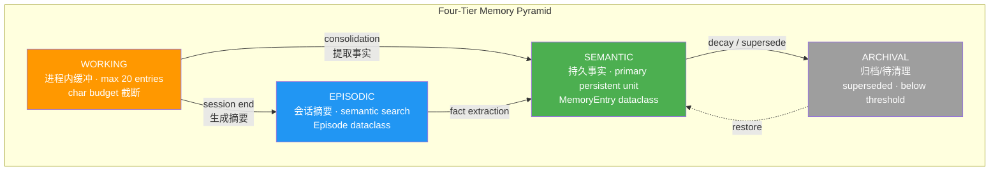
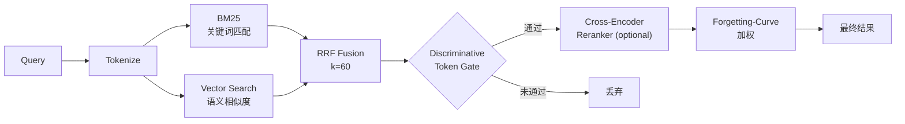
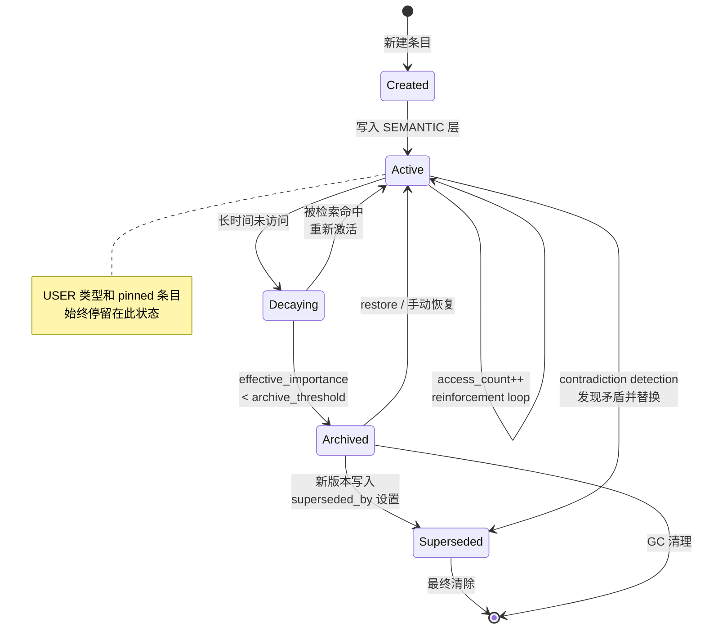

# 记忆系统深度解析

## 概述

Codex Pro 的记忆系统（Memory System）采用仿生学设计，模拟人类认知中的多层记忆结构。系统将信息按时效性、重要性和访问频率分布在四个层级中，通过 hybrid retrieval 实现高效召回，并借助 Ebbinghaus 遗忘曲线实现自然衰减，确保 prompt context 始终保持高信噪比。

---

## 四层架构（Four-Tier Architecture）

记忆系统由四个层级组成，从高频短时到低频持久依次为：

| Tier | 定位 | 存储特征 | 生命周期 |
|------|------|----------|----------|
| **WORKING** | 进程内缓冲区 | 最多 20 条，markdown 渲染后注入 prompt | 单次会话 |
| **EPISODIC** | 会话摘要 | Episode 对象，支持 semantic search | 跨会话，按重要性保留 |
| **SEMANTIC** | 持久事实 | 主要持久化单元（MemoryEntry dataclass） | 长期，受 decay 影响 |
| **ARCHIVAL** | 归档/待清理 | superseded_by 已设置或低于 archive threshold | 可恢复，最终清除 |

### WORKING 层

- 进程内环形缓冲区，容量上限 **20 entries**
- 每次 prompt 构建时渲染为 markdown，注入 system message
- 受 **char budget** 约束：超出预算时按 importance 降序截断
- 会话结束后不持久化，由 consolidation pipeline 提取有价值内容下沉

### EPISODIC 层

每段对话结束后生成 Episode 对象：

```python
@dataclass
class Episode:
    session_key: str          # 会话唯一标识
    summary: str              # LLM 生成的摘要
    message_range_start: int  # 消息范围起始
    message_range_end: int    # 消息范围结束
    entity_ids: List[str]     # 关联实体 ID
    importance: float         # 0-1 重要性评分
```

检索方式：通过 embedding 向量进行 semantic search，支持按 entity 和时间范围过滤。

### SEMANTIC 层

系统的**主要持久化单元**（primary persistent unit）。存储经过验证的跨会话事实，每条记录为一个 `MemoryEntry` dataclass 实例。

### ARCHIVAL 层

包含两类条目：
1. **被取代条目**：`superseded_by` 字段已设置，指向更新版本
2. **低活跃条目**：effective_importance 低于 archive threshold

归档条目仍可被检索召回（权重降低），支持版本回溯。



---

## 记忆类型（Memory Types）

系统定义两种记忆类型，决定条目的衰减策略：

### USER 类型

- 存储用户**偏好、身份、习惯**等个人信息
- **永不衰减**（exempt from decay）
- 当 `pinned=True` 时始终出现在 core snapshot 中
- 示例：用户姓名、语言偏好、编码风格偏好

### ENVIRONMENT 类型

- 存储**项目知识、技术栈信息、代码结构**等环境上下文
- **受 decay 影响**：长期不访问的条目 effective_importance 逐渐降低
- 项目切换后相关性可能下降
- 示例：项目目录结构、依赖版本、API 端点

---

## MemoryEntry 数据结构

`MemoryEntry` 是记忆系统的核心数据模型，完整字段定义如下：

```python
@dataclass
class MemoryEntry:
    id: str                    # UUID，全局唯一标识
    type: MemoryType           # USER | ENVIRONMENT
    tier: MemoryTier           # WORKING | EPISODIC | SEMANTIC | ARCHIVAL
    key: str                   # 语义键，用于去重和更新
    content: str               # 记忆内容（纯文本或结构化）
    tags: List[str]            # 标签，用于分类过滤
    source_session: str        # 来源会话 ID
    created_at: datetime       # 创建时间
    updated_at: datetime       # 最后更新时间
    importance: float          # 0-1 重要性评分（基础值）
    access_count: int          # 累计访问次数
    last_accessed: datetime    # 最后访问时间
    embedding_id: str          # 向量存储中的 embedding ID
    episode_id: Optional[str]  # 关联的 Episode ID
    version: int               # 版本号，支持版本追踪
    superseded_by: Optional[str]  # 被取代时指向新版本 ID
    source: ProvenanceLevel    # 来源可信度等级
    pinned: bool               # True 时始终包含在 core snapshot
```

记忆向量由单一索引承载（SQLite 持久化 + numpy 内存矩阵），一条记忆对应一个向量，不支持同一条目挂多个向量。知识库的向量是另一套独立存储（旁挂 `.npz` sidecar），与记忆向量物理隔离。

每个存储的向量都打上写入时的 `model_id`。启动时标记与当前嵌入模型不一致的行不会载入矩阵，而是进入重新嵌入队列——更换嵌入模型不会让旧向量以错误的语义空间参与检索。

---

## Provenance 系统（来源可信度）

每条 MemoryEntry 携带 `source` 字段标识其来源，系统据此决定冲突时的优先级：

| 等级 | 名称 | 权重 | 说明 |
|------|------|------|------|
| 3 | `user_stated` | 最高 | 用户明确陈述的事实 |
| 2 | `consolidated` | 高 | consolidation pipeline 提取并验证 |
| 1 | `model_inferred` | 中 | 模型从对话中推断 |
| 0 | `legacy` | 最低 | 旧版迁移数据，未经验证 |

### provenance_guard() 机制

```python
def provenance_guard(existing: MemoryEntry, incoming: MemoryEntry) -> bool:
    """
    防止低可信度来源覆盖高可信度记忆。
    返回 True 表示允许写入，False 表示拒绝。
    """
    if incoming.source.value >= existing.source.value:
        return True
    # 低优先级不可覆盖高优先级
    return False
```

!!! warning "安全注意"
    provenance_guard 是防止 prompt injection 篡改用户声明事实的关键防线。
    绝不可绕过此检查直接写入 SEMANTIC 层。

---

## Hybrid Retrieval（混合检索）

记忆检索采用多路召回 + 融合排序策略：

### 检索管线



### 各组件说明

1. **BM25 关键词检索**：基于 TF-IDF 的稀疏检索，擅长精确匹配
2. **Vector Embedding 检索**：通过 embedding 向量计算语义相似度
3. **RRF Fusion（Reciprocal Rank Fusion）**：
   - 公式：`score = Σ 1/(k + rank_i)`，其中 `k=60`
   - 平衡两路结果，避免单一路径主导
4. **Discriminative Token Gate**：过滤无区分性 token 匹配（如 stop words 命中）
5. **Cross-Encoder Reranker**（可选）：精排阶段，牺牲速度换精度
6. **Forgetting-Curve 加权**：最终得分乘以 effective_importance（见 Decay 章节）

精排由 `memory.rerankEnabled`（默认 `true`）控制，只要 RRF 融合后有候选就会执行，没有额外的候选数量门槛。它只作用于融合结果的前 `memory.rerankTopK` 条（默认 10），其余保持 RRF 原序，以此约束开销。

延迟预算分两层：单次推理等待 `memory.rerankTimeoutSeconds`（默认 5 秒），模型加载与下载走 `memory.rerankLoadTimeoutSeconds`。任一超时或失败都返回 RRF 原序——精排是纯增强，不构成召回的闸门。`memory.rerankMinScore` 大于 0 时会丢弃低分候选，但若全部被丢则回退为不过滤，避免阈值配错清空召回。

---

## Decay 机制（Ebbinghaus 遗忘曲线）

系统借鉴 Ebbinghaus 遗忘曲线模型，对记忆条目实施自然衰减：

### 核心公式

```python
# 半衰期计算：访问越多，遗忘越慢
half_life = base_half_life * (1 + log2(1 + access_count))

# 有效重要性：随时间指数衰减
days_since_access = (now - last_accessed).days
effective_importance = importance * (0.5 ** (days_since_access / half_life))
```

### 衰减行为

- **base_half_life**：基础半衰期，由系统配置决定（默认值待确认）
- 每次访问（检索命中）触发 `access_count += 1` 和 `last_accessed` 更新
- 访问相当于"复习"，延长半衰期
- effective_importance 降至 archive threshold 以下时，条目迁移至 ARCHIVAL 层

### 豁免规则

以下条目**不受 decay 影响**：

- `type == USER`：用户身份和偏好永不衰减
- `pinned == True`：固定条目始终保持在 core snapshot 中

基础半衰期取自 `memory.importanceDecayDays`，默认 30 天，最小值钳制为 1 天。所有非 USER 类型共用这一个基础值，不按 ENVIRONMENT 等子类型分别设置——类型间的差异体现在豁免规则（USER 完全豁免）而非不同的半衰期。

---

## 记忆生命周期



---

## 安全机制（Security）

记忆系统是 prompt injection 的高价值攻击面。系统在写入路径上部署多层防御：

### Prompt Injection 扫描

所有写入操作经过 `_scan_memory_content()` 门控：

```python
def _scan_memory_content(content: str) -> ScanResult:
    """
    扫描记忆内容中的 prompt injection 模式。
    支持中英文双语检测。
    阻止包含不可见 unicode 字符的内容。
    """
    # 1. 不可见 unicode 检测
    if contains_invisible_unicode(content):
        return ScanResult(blocked=True, reason="invisible_unicode")

    # 2. EN 注入模式匹配
    if matches_en_injection_patterns(content):
        return ScanResult(blocked=True, reason="en_injection")

    # 3. ZH 注入模式匹配
    if matches_zh_injection_patterns(content):
        return ScanResult(blocked=True, reason="zh_injection")

    return ScanResult(blocked=False)
```

### 防御层次

| 层级 | 机制 | 防御目标 |
|------|------|----------|
| 写入门控 | `_scan_memory_content()` | 阻止恶意内容进入存储 |
| Provenance Guard | `provenance_guard()` | 防止低权限覆盖高权限 |
| Unicode 清洗 | invisible unicode blocking | 阻止零宽字符等隐形攻击 |
| 双语检测 | EN + ZH pattern scanning | 覆盖中英文注入模式 |

!!! warning "安全注意"
    所有记忆写入路径（包括 consolidation pipeline 的自动写入）都必须经过
    `_scan_memory_content()` 检查。任何绕过此检查的代码路径都是安全漏洞。

!!! warning "安全注意"
    不可见 unicode 字符（如零宽空格 U+200B、零宽连接符 U+200D 等）可用于
    构造人眼不可见但模型可解析的指令。系统对此实施零容忍策略。

---

## 矛盾检测（Contradiction Detection）

当新记忆与已有记忆产生语义冲突时，系统通过矛盾检测机制解决：

### Contradiction 数据结构

```python
@dataclass
class Contradiction:
    entry_a_id: str          # 冲突条目 A
    entry_b_id: str          # 冲突条目 B
    description: str         # 矛盾描述
    confidence: float        # 检测置信度
    resolution: Optional[str]  # 解决方案
    resolved_at: Optional[datetime]
```

### 检测流程

1. **Heuristic 预筛选**：基于 key 相似度和 tag 重叠快速定位潜在冲突
2. **LLM Verification**：将候选冲突对提交 LLM 进行语义级判断
3. **Versioned Lattice**：维护版本格（lattice）记录条目间的取代关系

### 解决策略

- 高 provenance 取代低 provenance
- 时间更新者取代更旧者（同 provenance 时）
- 无法自动解决时标记为 pending，等待用户确认
- 被取代条目设置 `superseded_by`，迁移至 ARCHIVAL 层

---

## Consolidation（整合管线）

Consolidation 是记忆系统的"睡眠期"处理流程，类似人类睡眠时的记忆整合。在会话结束或系统空闲时触发：

### Sleep-Time Pipeline 步骤

```
1. Episode Creation
   └─ 将当前会话消息压缩为 Episode 对象
   └─ 生成 summary，标记 entity_ids 和 importance

2. Fact Extraction
   └─ 从 Episode 和 WORKING 层中提取可持久化的事实
   └─ 生成候选 MemoryEntry（tier=SEMANTIC）
   └─ 设置 source=consolidated (provenance=2)

3. Contradiction Detection
   └─ 将候选事实与现有 SEMANTIC 条目对比
   └─ 触发矛盾检测流程（见上节）
   └─ 解决冲突或标记 pending

4. Decay Pass
   └─ 遍历所有 SEMANTIC 条目
   └─ 重算 effective_importance
   └─ 将低于 threshold 的条目迁移至 ARCHIVAL
   └─ 更新 embedding index
```

### 触发条件

- 会话正常结束时自动触发
- 系统空闲超过配置时间阈值时触发
- 可手动触发（管理接口）

整合是异步执行的，不阻塞对话回复：会话结束时把任务交给后台任务调度器，而非在请求路径上同步跑完。

并发控制有两层。一是按会话去重：调度器维护 `pending` 集合，同一会话已在队列中时重复调度直接返回，避免同一份记忆被并行整合。二是任务分级：整合任务标记为 DURABLE 级别，调度器饱和时将其排队而不丢弃，并且传入的是可重入的任务工厂而非裸协程，失败后能被重新调用。

---

## 设计原则总结

1. **仿生设计**：四层架构模拟人类短期/长期记忆分层
2. **渐进遗忘**：Ebbinghaus 曲线确保无用信息自然退出
3. **访问强化**：频繁使用的记忆越来越不容易遗忘
4. **来源可信**：provenance 层级确保高质量信息不被低质量覆盖
5. **安全优先**：写入路径全面门控，双语注入检测
6. **混合检索**：BM25 + Vector + RRF 兼顾精确匹配和语义理解
7. **版本追踪**：矛盾检测 + versioned lattice 保证事实一致性

---

## 相关文档

- [架构总览](architecture.md)
- [工作区与会话身份](workspace-session-identity.md)
- [事件投递](events-delivery.md)

