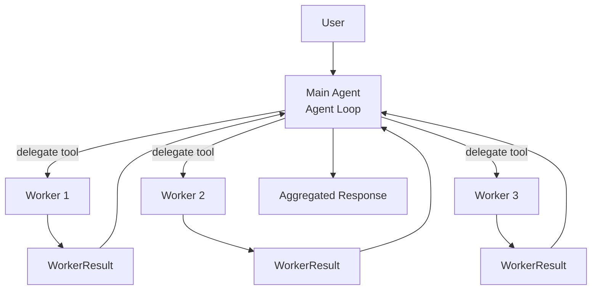
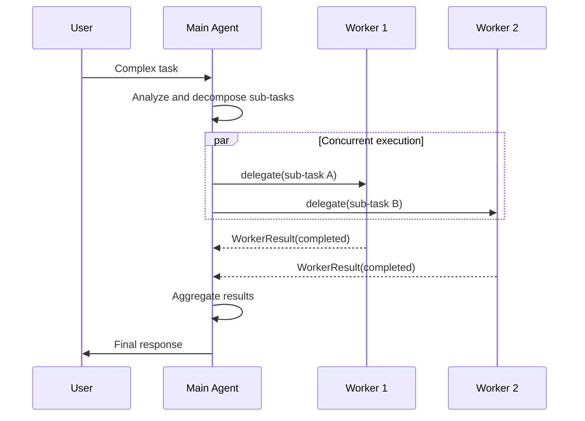
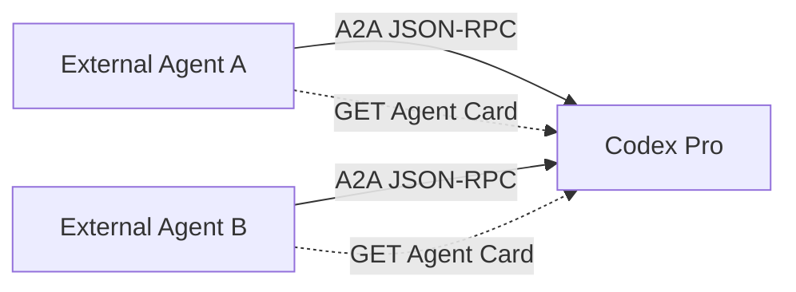

# Multi-Agent Collaboration

Codex Pro supports decomposing complex tasks and delegating them to multiple Worker Agents for concurrent execution, with the main Agent aggregating results. This mechanism is implemented via the `delegate` tool and is suited for parallelizable multi-step tasks.

## Collaboration Architecture



## 1. Worker Profile

Workers are configured through predefined Profile templates:

```python
@dataclass(frozen=True)
class WorkerProfile:
    id: str
    name: str
    description: str = ""
    instructions: str = ""          # Worker-specific instructions
    default_tools: tuple[str, ...]  # Available tool subset
    model: str = ""                 # Can specify independent model
    provider: str = ""
    max_iterations: int = 12        # Iteration limit
    max_tokens: int = 8192
    temperature: float = 0.4
```

The Profile constrains each Worker's capability boundary -- Workers can only use tools declared in `default_tools`, following the principle of least privilege.

## 2. Delegate Tool

The main Agent initiates delegation via the `delegate` tool:

- Specifies a Worker Profile or uses defaults
- Describes sub-task goals and constraints
- Can issue multiple concurrent delegate calls

## 3. Execution Results — WorkerResult

```python
@dataclass
class WorkerResult:
    task_index: int
    status: str = "completed"  # completed | failed | timeout
    output: str = ""
    error: str = ""
    iterations: int = 0
    tool_calls: int = 0
    duration_seconds: float = 0.0
    model: str = ""
    metadata: dict[str, Any] = field(default_factory=dict)
```

Workers return structured results upon completion. The main Agent can determine whether to retry or degrade based on status.

## 4. WorkerToolOutcome

Tool call results within a Worker:

```python
@dataclass(frozen=True)
class WorkerToolOutcome:
    text: str
    success: bool = True
```

Distinguishes success from failure so the Worker loop can assess progress rather than blindly retrying.

## 5. Execution Sequence



## 6. Security & Isolation

- **Tool restriction**: Workers can only access tools declared in their Profile's `default_tools`
- **Iteration cap**: `max_iterations` prevents Workers from looping indefinitely
- **Audit trail**: Every Worker tool call is logged in the audit trail (`audit.py`)
- **Error isolation**: A single Worker's failure does not affect other Workers or the main Agent

## 7. A2A Protocol Integration

Internal Worker delegation and A2A are separate paths. The current production A2A integration
is an inbound service: external agents discover Codex Pro and submit text tasks to it.



- **Agent Card**: Metadata describing Agent capabilities, used for service discovery
- **JSON-RPC**: Manages inbound tasks through `tasks/send`, `tasks/get`, and `tasks/cancel`
- **Identity isolation**: Authenticated tokens yield principals; tasks and sessions are
  principal-scoped

The internal `delegate` tool invokes only the local Worker runtime; it does not route to external
A2A agents. The repository's low-level `A2AClient` helper has no production caller and does not
use `net_guard`, so it must not receive untrusted URLs.

## 8. Internal Module Structure

| Module | Responsibility |
|--------|---------------|
| `multi_agent/models.py` | WorkerProfile, WorkerResult data structures |
| `multi_agent/runtime.py` | Worker execution runtime |
| `multi_agent/registry.py` | Worker Profile registry |
| `multi_agent/audit.py` | Delegation audit log |
| `tools/delegate.py` | Delegate tool implementation |
| `a2a/protocol.py` | A2A protocol implementation |
| `a2a/client.py` | Low-level client helper not wired into the production runtime |

## Delegation limits

Worker concurrency has its own configuration, independent of the tool concurrency partitioning strategy — the latter decides which calls *within one tool batch* may run in parallel (read-only, non-overlapping paths), and places no bound on the number of sub-agents.

| Option | Default | Description |
|--------|---------|-------------|
| `multiAgent.enabled` | `true` | Enable multi-agent delegation |
| `multiAgent.maxDepth` | `3` | Maximum delegation nesting depth |
| `multiAgent.maxParallelWorkers` | `4` | Maximum parallel sub-agents per delegation |
| `multiAgent.maxIterations` | `12` | Maximum iterations per sub-agent |

The two limits behave differently when exceeded: reaching `maxDepth` fails the `delegate` call outright and tells the primary agent to handle the task itself, whereas exceeding `maxParallelWorkers` truncates the task list to the cap and logs a warning — the dropped tasks never run. Split large batches into several delegations rather than relying on that truncation.
