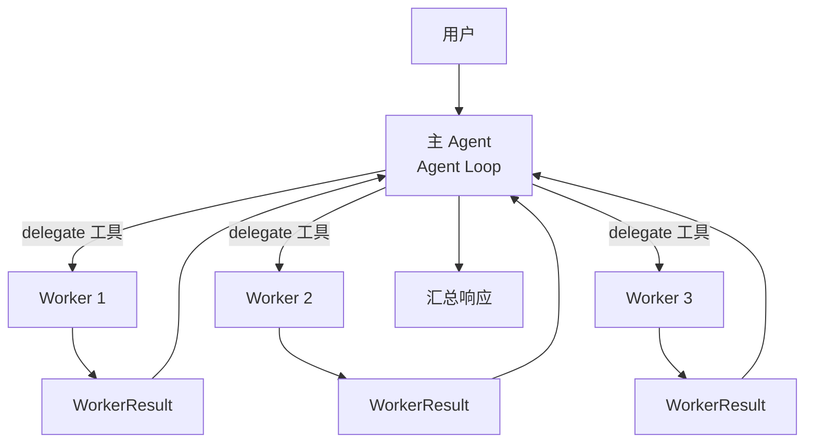
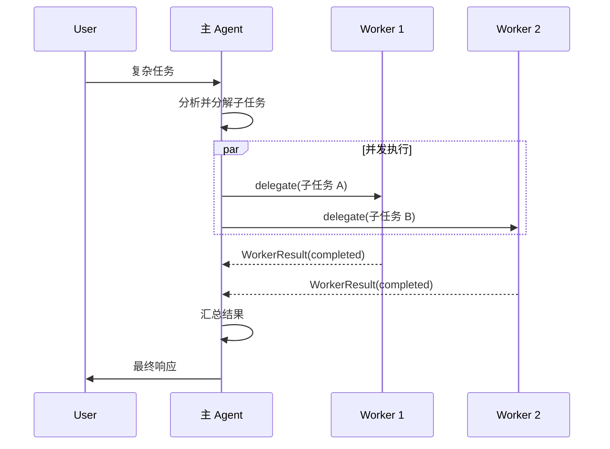
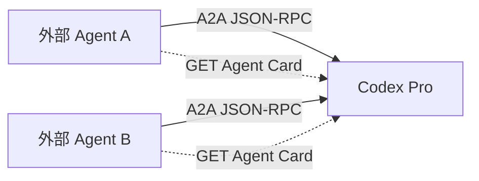

# 多 Agent 协作

Codex Pro 支持将复杂任务分解后委派给多个 Worker Agent 并发执行，由主 Agent 汇总结果。本机制通过 `delegate` 工具实现，适用于可并行化的多步骤任务。

## 协作架构



## 1. Worker Profile

Worker 通过预定义的 Profile 模板配置：

```python
@dataclass(frozen=True)
class WorkerProfile:
    id: str
    name: str
    description: str = ""
    instructions: str = ""          # Worker 专属指令
    default_tools: tuple[str, ...]  # 可用工具子集
    model: str = ""                 # 可独立指定模型
    provider: str = ""
    max_iterations: int = 12        # 迭代上限
    max_tokens: int = 8192
    temperature: float = 0.4
```

Profile 限定了 Worker 的能力边界——每个 Worker 只能使用 `default_tools` 声明的工具，遵循最小权限原则。

## 2. delegate 工具

主 Agent 通过 `delegate` 工具发起委派：

- 指定 Worker Profile 或使用默认配置
- 描述子任务目标和约束
- 可并发发起多个 delegate 调用

## 3. 执行结果 WorkerResult

```python
@dataclass
class WorkerResult:
    task_index: int
    status: str = "completed"  # completed | failed | timeout
    output: str = ""
    error: str = ""
    iterations: int = 0
    tool_calls: int = 0
    duration_seconds: float = 0.0
    model: str = ""
    metadata: dict[str, Any] = field(default_factory=dict)
```

Worker 执行完成后返回结构化结果，主 Agent 可根据 status 判断是否需要重试或降级。

## 4. WorkerToolOutcome

Worker 内部的工具调用结果：

```python
@dataclass(frozen=True)
class WorkerToolOutcome:
    text: str
    success: bool = True
```

区分成功与失败，使 Worker 循环能判断进展而非盲目重试。

## 5. 执行时序



## 6. 安全与隔离

- **工具限制**：Worker 只能访问 Profile 中 `default_tools` 声明的工具
- **迭代上限**：`max_iterations` 防止 Worker 无限循环
- **审计追踪**：每个 Worker 的工具调用都记录在审计日志中（`audit.py`）
- **错误隔离**：单个 Worker 失败不影响其他 Worker 和主 Agent

## 7. A2A 协议集成

内部 Worker 委派与 A2A 是两条独立路径。当前 A2A 生产接线是入站服务：外部 Agent
发现 Codex Pro，并向它提交文本任务。



- **Agent Card**：描述 Agent 能力的元数据，用于服务发现
- **JSON-RPC**：通过 `tasks/send`、`tasks/get` 和 `tasks/cancel` 管理入站任务
- **身份隔离**：认证 token 派生 principal，任务和会话按 principal 分区

内部 `delegate` 工具只调用本地 Worker 运行时，不会路由到外部 A2A Agent。代码库中的
低层 `A2AClient` 辅助类没有生产调用方，也未经 `net_guard`，不应接收不可信 URL。

## 8. 内部模块结构

| 模块 | 职责 |
|------|------|
| `multi_agent/models.py` | WorkerProfile, WorkerResult 数据结构 |
| `multi_agent/runtime.py` | Worker 执行运行时 |
| `multi_agent/registry.py` | Worker Profile 注册表 |
| `multi_agent/audit.py` | 委派审计日志 |
| `tools/delegate.py` | delegate 工具实现 |
| `a2a/protocol.py` | A2A 协议实现 |
| `a2a/client.py` | 未接入生产运行时的低层客户端辅助类 |

## 委派限额

Worker 的并发度有独立配置，与工具并发分区策略无关——后者决定的是「一批工具调用中哪些可以并行」（只读且路径不冲突才并行），不约束子代理数量。

| 配置项 | 默认值 | 说明 |
|--------|--------|------|
| `multiAgent.enabled` | `true` | 是否启用多代理委派 |
| `multiAgent.maxDepth` | `3` | 委派嵌套最大深度 |
| `multiAgent.maxParallelWorkers` | `4` | 单次委派的并行子代理数上限 |
| `multiAgent.maxIterations` | `12` | 子代理的最大迭代轮数 |

两种超限的处理方式不同：委派深度达到 `maxDepth` 时，`delegate` 调用直接失败并提示主代理自行处理；任务数超过 `maxParallelWorkers` 时，任务列表被截断到上限并记录一条告警，已截掉的任务不会执行。任务数多于上限时应分批委派，而不是依赖截断。
