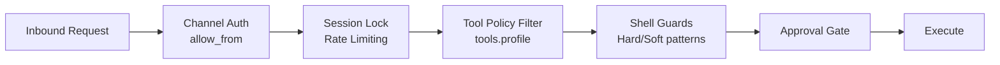
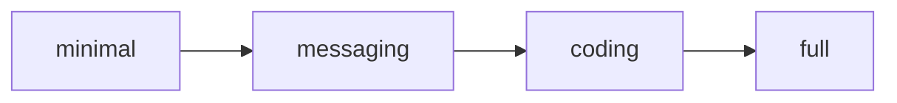

# Security Model

Codex Pro's security architecture follows a defense-in-depth principle, stacking multiple independent checks along the request path. This document is organized by threat surface, covering the full chain from channel entry to tool execution.

## Security Layers Overview



## 1. Security Profiles (security.profile — 3 levels)

The `security.profile` configuration controls the overall security posture:

| Profile | Scenario | Description |
|---------|----------|-------------|
| `personal_cli` | Single user, local | Most permissive, trusts local operator |
| `daemon` | Background service | Reduced permissions, unattended scenarios |
| `public_gateway` | Externally exposed gateway | Most restrictive, assumes untrusted input; does not create tenant isolation |

### Multi-client vs. multi-tenant boundaries { #multi-client-tenant-boundary }

Codex Pro can process multiple channels, clients, and sessions concurrently. That is not the same property as a security-reviewed multi-tenant platform:

| Mechanism | What it provides | What it does not provide |
|-----------|------------------|--------------------------|
| Session keys / locks | Model-context and concurrency boundaries | Caller authentication or resource authorization |
| `api_tokens` / `admin_tokens` | Request authentication and read/admin scopes | Turning every token into a global user identity or partitioning every instance resource |
| `security.profile: public_gateway` | Additional denials for high-risk tools and capabilities | Tenant partitions for the database, sessions, tasks, or workspace |

!!! danger "Authentication is not tenant isolation"
    Multiple ordinary tokens are trusted callers of the same Codex Pro instance by default. Do not treat "one token per person" as a hard isolation boundary. Some resources apply finer owner/scope checks, but that does not imply that every Gateway resource has the same boundary. For mutually untrusted users or organizations, run a separate process per tenant and separate its workspace, data directory, credentials, and network entry point.

## 2. Tool Profiles (tools.profile — 4 levels)



Tools are exposed in layers; higher profiles include all tools from lower ones:

| Profile | Added Tools | Typical Use |
|---------|-------------|-------------|
| `minimal` | agents_list, clarify, knowledge_search, list_dir, message, notify, read_file, read_spill, search_files, session_search, skill_view, skills_list, todo | Read-only + messaging |
| `messaging` | image_generate, memory, text_to_speech, vision_analyze | Multimedia interaction |
| `coding` | edit_file, knowledge_index, patch, task, workflow, write_file | File read/write |
| `full` | cronjob, exec, execute_code, process, skill_install, skill_manage | Process execution + skill management |

`agents_list` is a reserved policy name with no current tool implementation, so it is not callable even though it appears in the `minimal` policy set.

!!! warning "High-Risk Tools"
    `exec`, `execute_code`, and `process` carry the `process.exec` capability and can run arbitrary commands. They are only exposed at `full` profile and are further gated by shell guards and the approval gate.

## 3. Capabilities System

Each tool declares capability labels used for policy filtering and audit:

```python
# Examples
"exec":           {"process.exec"}
"edit_file":      {"fs.read", "fs.write"}
"image_generate": {"media.generate", "network.outbound"}
"memory":         {"memory.read", "memory.write"}
```

External MCP tools uniformly receive the `mcp.call` capability label.

## 4. Shell Guards

Shell guards perform pattern matching on command-execution tool arguments, with two enforcement levels:

### Hard Block (deny) — Cannot be overridden

| Pattern | Description |
|---------|-------------|
| `root_rm` | `rm -rf /` and system root directories |
| `block_device_write` | `dd of=/dev/` |
| `mkfs` | Filesystem formatting |
| `shutdown` | shutdown/reboot/halt/poweroff |
| Sensitive path reads | /etc/shadow, authorized_keys, etc. |

### Soft Block (ask) — Requires approval

- Recursive deletion (non-root directories)
- Network outbound commands
- Permission modification commands

Design considerations:
- Case-insensitive matching (`re.I`) prevents bypass on case-insensitive filesystems (e.g., macOS)
- Command normalization (`normalizer.py`) + shell tokenization (`tokenizer.py`) resist pipe/alias evasion
- Quoted data does not trigger hard blocks (`codex "rm -rf /"` is not a false positive)

## 5. Path Policy

`path_policy.py` defines filesystem access boundaries, restricting which directories tools may read or write.

## 6. Network Guard

`net_guard.py` controls outbound network requests, blocking unauthorized external connections.

## 7. Approval Mechanisms

### ApprovalGate

Three-state decisions for tool calls:

| Decision | Meaning |
|----------|---------|
| `allow` | Execute immediately |
| `ask` | Requires human approval before execution |
| `deny` | Reject with reason |

### Trust Signals (First-Class Fields)

Trust signals on InboundEvent are **first-class typed fields**, deliberately not placed in the metadata dict:

```python
unattended: bool = False      # No human at keyboard (scheduled/cron)
cron_authorized: bool = False  # This cron job passed upfront approval
is_control: bool = False       # Internal control command
```

!!! warning "Why Not Metadata"
    The metadata dict is populated by external channels from untrusted caller input. If trust signals lived in metadata, a webhook body could forge `{"_cron_authorized": true}` to bypass EXEC approval. First-class fields can only be set by trusted internal producers (scheduler/delivery).

### Smart Approval

`smart_approval.py` + `risk_classifier.py` perform risk grading on tool calls, enabling automatic pass-through for low-risk operations.

### Approval Allowlist

Pre-approved tool + argument pattern combinations to reduce interaction friction.

## 8. Credential Security

```yaml
credentials:
  encryption_key_env: CODEX_PRO_CREDENTIAL_KEY
  require_encryption: true
```

- Channel tokens (Telegram/Discord/Slack, etc.) are stored encrypted
- Encryption key is read from environment variable, never persisted to disk
- With `require_encryption: true`, missing key causes startup refusal

## 9. Memory Write Security

All memory writes pass through `_scan_memory_content()`:

- **Injection detection**: matches 20+ patterns (English and Chinese), including prompt injection, role hijack, and secrets exfiltration
- **Invisible character blocking**: detects U+200B/U+200C/U+200D/U+2060/U+FEFF and other zero-width characters
- Any pattern match rejects the write and logs an audit entry

The outbound policy is static: the scheme allowlist is fixed to `http` and `https` (`file`, `data`, `gopher`, `ftp` and the rest are refused before a socket opens), and the address rules live in the module itself — not read from configuration, with no runtime reload hook.

The guard has five layers, shared by media downloads and the web tools alike:

| Layer | Purpose |
|-------|---------|
| Scheme allowlist | `http` / `https` only, so `file://` and `data:` cannot turn a URL fetch into a local read |
| Address validation | Rejects loopback, private ranges and link-local addresses, including the cloud metadata endpoint `169.254.169.254` |
| DNS pinning | Pins the resolution after validating the hostname, so the client cannot re-resolve into a DNS rebinding |
| Per-hop revalidation | Every 30x target is validated again; an unchecked redirect is a redirect into the network |
| Size ceiling | Enforced on `Content-Length` and on the bytes actually received |
