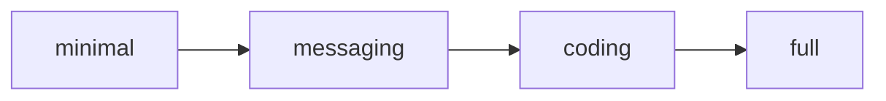

# 安全模型

Codex Pro 的安全体系按「纵深防御」原则设计，在请求路径上叠加多层独立检查。本文按威胁面组织，覆盖从通道入口到工具执行的完整链路。

## 安全层次总览


## 1. 安全档位 security.profile（3 级）

配置项 `security.profile` 控制整体安全姿态：

| 档位 | 场景 | 说明 |
|------|------|------|
| `personal_cli` | 单用户本地运行 | 最宽松，信任本地操作者 |
| `daemon` | 后台服务 | 缩减权限，无人值守场景 |
| `public_gateway` | 对外暴露的网关 | 最严格，假定输入不可信；不代表多租户隔离 |

### 多客户端与多租户的边界 { #multi-client-tenant-boundary }

Codex Pro 可以并发处理多个通道、客户端和会话，但这不等于一个经过安全认证的多租户平台：

| 机制 | 它提供什么 | 它不提供什么 |
|------|--------------|------------------|
| 会话键 / 会话锁 | 模型上下文与并发处理边界 | 调用方身份认证或资源访问授权 |
| `api_tokens` / `admin_tokens` | 请求认证与普通/管理两级 scope | 将每个 Token 自动变成全局用户身份、隔离所有实例资源 |
| `security.profile: public_gateway` | 追加高风险工具与能力的拒绝规则 | 数据库、会话、任务和工作区的租户级分区 |

!!! danger "认证不等于租户隔离"
    多个普通 Token 默认属于同一 Codex Pro 实例的受信任调用方，不要把“每人发一枚 Token”当作强隔离。某些资源有更细的 owner/scope 校验，但不能由此推导整个 Gateway 都有相同边界。需要容纳互不信任的用户或组织时，应为每个租户运行独立进程，并分离工作区、数据目录、凭据和网络入口。

## 2. 工具档位 tools.profile（4 级）



工具按档位分层暴露，高档位包含低档位全部工具：

| 档位 | 新增工具 | 典型用途 |
|------|----------|----------|
| `minimal` | agents_list, clarify, knowledge_search, list_dir, message, notify, read_file, read_spill, search_files, session_search, skill_view, skills_list, todo | 纯只读 + 消息 |
| `messaging` | image_generate, memory, text_to_speech, vision_analyze | 多媒体交互 |
| `coding` | edit_file, knowledge_index, patch, task, workflow, write_file | 文件读写 |
| `full` | cronjob, exec, execute_code, process, skill_install, skill_manage | 进程执行 + 技能管理 |

`agents_list` 是保留的策略名称，当前没有工具实现，因此即使出现在 `minimal` 策略集中也不可调用。

!!! warning "高危工具"
    `exec`、`execute_code`、`process` 具备 `process.exec` 能力，可执行任意命令。仅在 `full` 档位暴露，且受 Shell 守卫和审批门双重约束。

## 3. 能力声明系统 Capabilities

每个工具声明自身能力标签，用于策略过滤和审计：

```python
# 示例
"exec":         {"process.exec"}
"edit_file":    {"fs.read", "fs.write"}
"image_generate": {"media.generate", "network.outbound"}
"memory":       {"memory.read", "memory.write"}
```

MCP 外部工具统一获得 `mcp.call` 能力标签。

## 4. Shell 守卫 Guards

Shell 守卫对命令执行类工具的参数做模式匹配，分两级处置：

### 硬阻断（deny）— 不可覆盖

| 模式 | 描述 |
|------|------|
| `root_rm` | `rm -rf /` 及系统根目录 |
| `block_device_write` | `dd of=/dev/` |
| `mkfs` | 格式化文件系统 |
| `shutdown` | shutdown/reboot/halt/poweroff |
| 敏感路径读取 | /etc/shadow, authorized_keys 等 |

### 软拦截（ask）— 需审批通过

- 递归删除（非根目录）
- 网络外联命令
- 权限修改命令

设计要点：
- 大小写不敏感匹配（`re.I`），防止 macOS 等大小写不敏感文件系统的绕过
- 命令归一化（`normalizer.py`）+ Shell 分词（`tokenizer.py`）防管道/别名逃逸
- 引号内数据不触发硬阻断（`codex "rm -rf /"` 不会误报）

## 5. 路径策略 Path Policy

`path_policy.py` 定义文件系统访问边界，限制工具可读写的目录范围。

## 6. 网络守卫 Net Guard

`net_guard.py` 控制出站网络请求，阻止未授权的外联行为。

## 7. 审批机制

### ApprovalGate

工具调用的三态决策：

| 决策 | 含义 |
|------|------|
| `allow` | 直接执行 |
| `ask` | 需要人工批准后执行 |
| `deny` | 直接拒绝，附带原因 |

### 信任信号（首类字段）

InboundEvent 上的信任信号是 **首类类型字段**，刻意不放在 metadata dict 中：

```python
unattended: bool = False      # 无人值守（定时/cron）
cron_authorized: bool = False  # 此 cron job 已通过前置审批
is_control: bool = False       # 内部控制命令
```

!!! warning "为什么不用 metadata"
    metadata 由外部通道从不可信的调用方输入填充。若信任信号放在 metadata 中，webhook body 可以伪造 `{"_cron_authorized": true}` 绕过 EXEC 审批。首类字段只有内部可信生产者（scheduler/delivery）能设置。

### 智能审批 Smart Approval

`smart_approval.py` + `risk_classifier.py` 对工具调用做风险分级，实现低风险操作自动放行。

### 审批白名单 ApprovalAllowlist

预批准的工具 + 参数模式组合，减少交互摩擦。

## 8. 凭据安全

```yaml
credentials:
  encryption_key_env: CODEX_PRO_CREDENTIAL_KEY
  require_encryption: true
```

- 通道 token（Telegram/Discord/Slack 等）加密存储
- 密钥从环境变量读取，不落盘
- `require_encryption: true` 时缺少密钥将拒绝启动

## 9. 记忆写入安全

所有记忆写入经过 `_scan_memory_content()` 扫描：

- **注入检测**：匹配 20+ 模式（中英双语），包括 prompt injection、role hijack、secrets 外泄
- **隐形字符阻断**：检测 U+200B/U+200C/U+200D/U+2060/U+FEFF 等零宽字符
- 命中任一模式则拒绝写入并记录审计日志

出站防护的策略是静态的：协议白名单固定为 `http` 与 `https`（`file`、`data`、`gopher`、`ftp` 等在建立连接前即被拒绝），地址判定规则同样写在模块内，不从配置读取、也没有运行时重载入口。

防护由五层构成，媒体下载与 web 工具共用同一份实现：

| 层 | 作用 |
|----|------|
| 协议白名单 | 只允许 `http` / `https`，阻断 `file://`、`data:` 把 URL 抓取变成本地读取 |
| 地址校验 | 拒绝回环、私有网段、链路本地地址（含云元数据端点 `169.254.169.254`） |
| DNS 钉定 | 校验主机名后钉定解析结果，避免客户端重新解析造成 DNS rebinding |
| 逐跳复检 | 每次 30x 跳转都重新校验目标，未检查的重定向等同于放行入内网 |
| 体积上限 | 同时约束 `Content-Length` 与实际接收字节数 |
