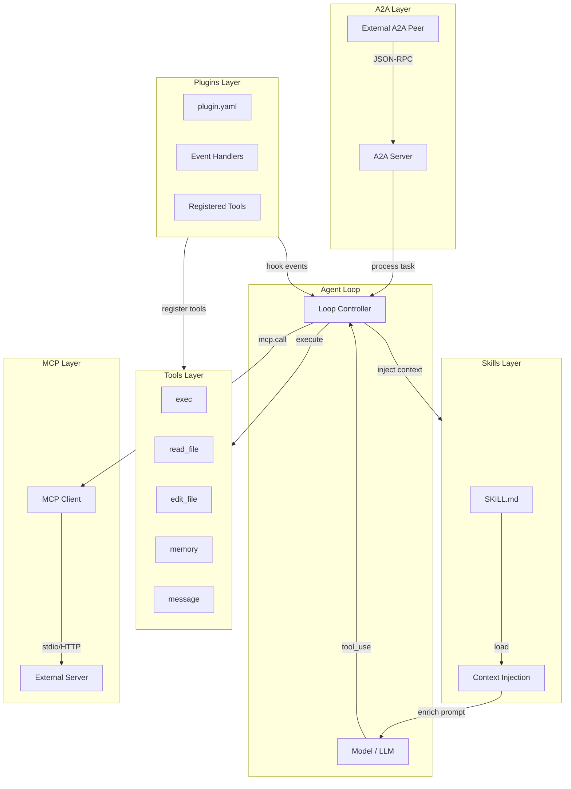
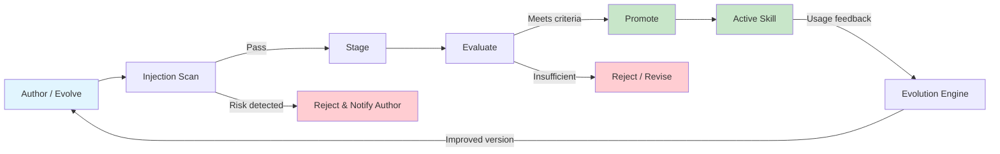

# Skills, Tools & Plugins Comparison

codex-pro provides five capability extension mechanisms, each serving a distinct role with its
own lifecycle and security boundary. This document systematically compares Tool, Skill, Plugin,
MCP, and A2A to help developers choose the right extension approach.

---

## 1. Tool

A Tool is an **executable capability interface** that the Agent Loop can invoke directly. Each
Tool is implemented as a Python class inheriting from the public
`codex_pro.tools.Tool` contract.

### Core Characteristics

- **name / description / parameters**: Declarative metadata used by the model for selection and
  argument binding
- **Return type**: `ToolResult` (contains success/error status, output text, optional metadata)
- **Capability declarations**: Each Tool declares required capabilities (e.g., `fs.read`,
  `process.exec`, `net.fetch`)
- **Policy filtering**: `tools.profile` configuration (minimal / messaging / coding / full)
  determines which Tools are visible to the current session
- **Security gating**: Execution passes through an approval gate and shell guards

### Typical Examples

| Tool Name | Capability | Purpose |
|-----------|-----------|---------|
| `exec` | `process.exec` | Execute shell commands |
| `read_file` | `fs.read` | Read file contents |
| `edit_file` | `fs.write` | Edit files |
| `memory` | `memory.read`, `memory.write` | Read/write memory system |
| `message` | `messaging.send` | Send messages |
| `search_files` | `fs.read` | Search file contents |

### Invocation Flow

```
Model emits tool_use → Agent Loop parses → Policy check → Approval Gate → Tool.execute() → ToolResult
```

---

## 2. Skill

A Skill is a **domain knowledge and workflow package**. Unlike Tools, Skills do not execute
operations directly. Instead, they enrich the model's context with specialized knowledge and
decision workflows via context injection.

### Core Characteristics

- **Structure**: `SKILL.md` file + optional dependency resources (templates, references, etc.)
- **Load source**: `skills/` directory (bundled built-in or workspace-level)
- **Management tools**: `skill_view`, `skills_list`, `skill_install`, `skill_manage`
- **Auto-evolution**: The evolution engine can auto-generate or improve Skills based on usage
  feedback
- **Risk grading**: `SkillRisk` type, classified as `low` or `high`

### Admission Process

Before a Skill goes live, it must pass a complete admission process:

1. **Author / Evolve**: Written manually or auto-generated by the evolution engine
2. **Injection Scan**: Scans SKILL.md content for prompt injection risks
3. **Stage**: Enters staging state with limited availability
4. **Evaluate**: Assessed for effectiveness and safety through actual usage
5. **Promote / Reject**: Promoted to active Skill if evaluation passes; rejected otherwise

### Hot Reload

Skills support hot reload — modifications to SKILL.md take effect without restarting the Agent.

---

## 3. Plugin

A Plugin is a **loadable Python extension** that allows third parties to extend codex-pro's
capabilities without modifying core code.

### Core Characteristics

- **Structure**: `plugin.yaml` (metadata declaration) + `__init__.py` or specified entry point
- **Load timing**: Auto-scanned and loaded from `plugins/` directory at Agent startup
- **Extension capabilities**:
  - Register new Tools
  - Add event handlers (listen to system events)
  - Extend existing functionality
- **Trust boundary**: Plugins run within the Agent process with elevated privileges; source must
  be trusted

### Relationship to Tools

A Plugin can **register** new Tools, but a Plugin is not itself a Tool. Plugins are the
extension mechanism; Tools are the capability interface. A single Plugin can register zero to
many Tools.

---

## 4. MCP (Model Context Protocol)

MCP is an **external tool protocol client** implementing the Model Context Protocol
specification. It bridges external tool servers into the Agent's tool registry.

### Core Characteristics

- **Transport**: Supports stdio and HTTP transports (`codex_pro/mcp/transport.py`)
- **Tool exposure**: External tools are registered with `mcp_*` prefix, managed uniformly via
  `mcp.call` capability
- **Dynamic discovery**: Can connect to new MCP servers at runtime with reconnection support
- **Protocol standard**: Follows the open MCP specification, interoperable with any compliant
  server

### How It Works

```
Agent Loop → mcp_tool_name → MCP Client → [stdio/HTTP] → External MCP Server → Result
```

### Advantages

- No need to implement external tools as Python code
- External servers can be implemented in any language
- Supports hot reconnection without interrupting Agent operation

---

## 5. A2A (Agent-to-Agent)

A2A is an **inter-agent task protocol**. The production runtime currently implements the
inbound side: external agents can discover Codex Pro and delegate text tasks to it.

### Core Characteristics

- **Protocol foundation**: Agent Card + JSON-RPC (`codex_pro/a2a/protocol.py`, `server.py`)
- **Inbound tasks**: External peers call Codex Pro through `tasks/send`, `tasks/get`, and
  `tasks/cancel`
- **Identity isolation**: Bearer tokens yield opaque principals; tasks and sessions are
  principal-scoped
- **Bounded retention**: Task storage is constrained by both a TTL and a count limit

### How It Works

```
External agent discovers Agent Card → calls Codex Pro JSON-RPC endpoint → Agent Loop processes → task state/result returned
```

The repository retains a low-level `A2AClient` helper, but it has no production caller and does
not use the shared `net_guard` redirect-by-redirect SSRF protection. There is currently no
model-callable outbound A2A delegation tool.

### Difference from MCP

| Dimension | MCP | A2A |
|-----------|-----|-----|
| Target | Tools | Agents |
| Granularity | Single function call | Complete task |
| Protocol | Tool protocol | Task protocol |
| Counterpart | Tool Server | Agent peer |

---

## Comparison Overview

| Aspect | Tool | Skill | Plugin | MCP | A2A |
|--------|------|-------|--------|-----|-----|
| **Nature** | Callable function | Knowledge package | Code extension | Protocol client | Inbound task protocol |
| **Interface** | Python class | SKILL.md | plugin.yaml | stdio/HTTP | Agent Card |
| **Called by** | Model / Loop | Context injection | Loop hooks | Model (as tool) | External A2A peer |
| **Security** | Policy + Guards | Injection scan | Trust boundary | mcp.call cap | Bearer principal + owner isolation |
| **Hot reload** | No | Yes | No | Yes (reconnect) | No |
| **Auto-evolve** | No | Yes (evolution) | No | No | No |
| **Language** | Python | Markdown | Python | Any | Any |
| **Location** | tools/ | skills/ | plugins/ | mcp config | a2a/ + gateway |

---

## Architecture Diagram

The following Mermaid diagram shows how the five mechanisms connect to the Agent Loop:



---

## Skill Lifecycle

The following Mermaid diagram illustrates the complete Skill lifecycle from creation to
production:



### Stage Descriptions

| Stage | Description | Output |
|-------|-------------|--------|
| Author / Evolve | Manual authoring or engine auto-generation of SKILL.md | Draft Skill |
| Injection Scan | Static scan for prompt injection and malicious patterns | Security report |
| Stage | Enters staging with controlled-environment-only access | Staged Skill |
| Evaluate | Assessed for effectiveness and safety through real usage | Evaluation metrics |
| Promote | Elevated to fully available active Skill | Active Skill |
| Reject | Denied with reason feedback | Rejection record |

---

## Selection Guide

### When to Use a Tool

- You need to execute a concrete operation (read/write files, run commands, network requests)
- The operation result must be returned to the model for further reasoning
- You need precise parameter validation and permission control

### When to Use a Skill

- You need to inject domain expertise into the model's context
- The workflow is complex and requires step-by-step guidance
- The knowledge content may evolve and improve over time

### When to Use a Plugin

- You need to add custom logic outside the core codebase
- You need to listen to system events for additional processing
- You need to register a group of related Tools in bulk

### When to Use MCP

- An external system already has an MCP-compliant tool server
- The tool implementation language is not Python
- You need integration with third-party AI tool ecosystems

### When to Use A2A

- An external agent or orchestrator needs to submit text tasks to Codex Pro
- An external system needs standard task status and cancellation methods
- Multiple API-token principals need isolated tasks and sessions

If Codex Pro itself must delegate to external agents, this version has no production outbound
entry point.

---

## Related Documentation

- [Architecture Overview](architecture.en.md)
- [Agent Loop](agent-loop.md)
- [Events & Delivery](events-delivery.en.md)
