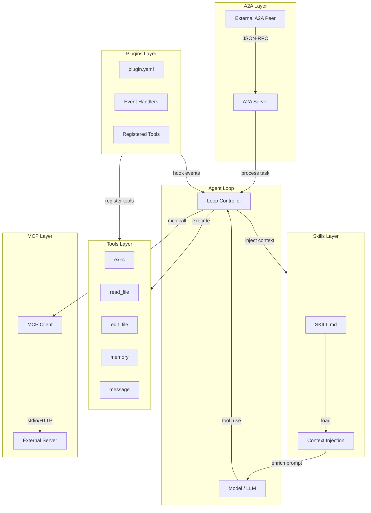
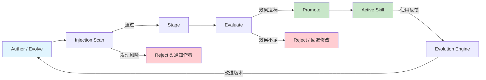

# Skill、Tool 与 Plugin 对照

codex-pro 提供五种能力扩展机制，各自承担不同职责、拥有不同生命周期与安全边界。本文
对 Tool、Skill、Plugin、MCP、A2A 进行系统对照，帮助开发者选择合适的扩展方式。

---

## 1. Tool（工具）

Tool 是 Agent Loop 可直接调用的**可执行能力接口**。每个 Tool 以 Python class 形式实现，
继承自公开入口 `codex_pro.tools.Tool`。

### 核心特征

- **name / description / parameters**：声明式元数据，供 model 选择与参数绑定
- **返回类型**：`ToolResult`（包含 success/error 状态、output 文本、可选 metadata）
- **能力声明**：每个 Tool 声明所需 capabilities（如 `fs.read`、`process.exec`、`net.fetch`）
- **策略过滤**：通过 `tools.profile` 配置（minimal / messaging / coding / full）决定哪些
  Tool 对当前 session 可见
- **安全门控**：执行前经过 approval gate 与 shell guards 检查

### 典型示例

| Tool 名称 | 能力声明 | 用途 |
|-----------|---------|------|
| `exec` | `process.exec` | 执行 shell 命令 |
| `read_file` | `fs.read` | 读取文件内容 |
| `edit_file` | `fs.write` | 编辑文件 |
| `memory` | `memory.read`, `memory.write` | 读写记忆系统 |
| `message` | `messaging.send` | 发送消息 |
| `search_files` | `fs.read` | 搜索文件内容 |

### 调用流程

```
Model 输出 tool_use → Agent Loop 解析 → Policy 检查 → Approval Gate → Tool.execute() → ToolResult
```

---

## 2. Skill（技能）

Skill 是**领域知识与工作流的封装包**。与 Tool 不同，Skill 不直接执行操作，而是通过
上下文注入为 model 提供专业知识与决策流程。

### 核心特征

- **结构**：`SKILL.md` 文件 + 可选依赖资源（模板、参考文档等）
- **加载源**：`skills/` 目录（bundled 内置 或 workspace 工作区级别）
- **管理工具**：`skill_view`、`skills_list`、`skill_install`、`skill_manage`
- **自动演化**：evolution engine 可根据使用反馈自动生成或改进 Skill
- **风险分级**：`SkillRisk` 类型，分为 `low`（低风险）和 `high`（高风险）

### 准入流程

Skill 上线前需经历完整的准入流程：

1. **Author / Evolve**：人工编写或 evolution engine 自动生成
2. **Injection Scan**：扫描 SKILL.md 内容，检测 prompt injection 风险
3. **Stage**：进入 staging 状态，可被有限使用
4. **Evaluate**：通过实际调用评估效果与安全性
5. **Promote / Reject**：通过评估则提升为正式 Skill，否则拒绝

### 热重载

Skill 支持热重载——修改 SKILL.md 后无需重启 Agent 即可生效。

---

## 3. Plugin（插件）

Plugin 是**可加载的 Python 扩展**，允许第三方在不修改核心代码的前提下扩展 codex-pro
的能力。

### 核心特征

- **结构**：`plugin.yaml`（声明元数据）+ `__init__.py` 或指定 entry point
- **加载时机**：Agent 启动阶段从 `plugins/` 目录自动扫描加载
- **扩展能力**：
  - 注册新的 Tool
  - 添加 event handler（监听系统事件）
  - 扩展现有功能行为
- **信任边界**：Plugin 运行在 Agent 进程内，享有较高权限，需信任来源

### 与 Tool 的关系

Plugin 可以 **注册** 新 Tool，但 Plugin 本身不是 Tool。Plugin 是扩展机制，Tool 是
能力接口。一个 Plugin 可注册零到多个 Tool。

---

## 4. MCP（Model Context Protocol）

MCP 是**外部工具协议客户端**，实现了 Model Context Protocol 规范，将外部 tool server
桥接入 Agent 的工具注册表。

### 核心特征

- **传输方式**：支持 stdio 和 HTTP 两种 transport（`codex_pro/mcp/transport.py`）
- **工具暴露**：外部工具以 `mcp_*` 前缀注册，统一通过 `mcp.call` capability 管理
- **动态发现**：可在运行时连接新的 MCP server，支持断线重连
- **协议标准**：遵循 MCP 开放规范，与任何兼容 server 互操作

### 工作模式

```
Agent Loop → mcp_tool_name → MCP Client → [stdio/HTTP] → External MCP Server → Result
```

### 优势

- 无需将外部工具实现为 Python 代码
- 外部 server 可用任何语言实现
- 支持热重连（reconnect），不中断 Agent 运行

---

## 5. A2A（Agent-to-Agent）

A2A 是**Agent 间任务协议**。当前生产运行时实现的是入站端：外部 Agent 可发现
Codex Pro，并把文本任务委派给它。

### 核心特征

- **协议基础**：Agent Card + JSON-RPC（`codex_pro/a2a/protocol.py`、`server.py`）
- **入站任务**：外部 peer 通过 `tasks/send`、`tasks/get` 和 `tasks/cancel` 调用 Codex Pro
- **身份隔离**：Bearer token 派生不透明 principal，任务和会话按 principal 隔离
- **有界保留**：任务存储同时受 TTL 和数量上限约束

### 工作模式

```
外部 Agent 发现 Agent Card → 调用 Codex Pro JSON-RPC 端点 → Agent Loop 处理 → 任务状态/结果返回
```

代码库保留了低层 `A2AClient` 辅助类，但它没有生产调用方，也未经共享
`net_guard` 的逐跳 SSRF 防护；当前不存在可供 model 调用的 A2A 出站委派工具。

### 与 MCP 的区别

| 维度 | MCP | A2A |
|------|-----|-----|
| 对象 | 工具（Tool） | Agent |
| 粒度 | 单次函数调用 | 完整任务 |
| 协议 | Tool protocol | Task protocol |
| 对端 | Tool Server | Agent peer |

---

## 对照总览表

| 维度 | Tool | Skill | Plugin | MCP | A2A |
|------|------|-------|--------|-----|-----|
| **本质** | 可调用函数 | 知识包 | 代码扩展 | 协议客户端 | 入站任务协议 |
| **接口形式** | Python class | SKILL.md | plugin.yaml | stdio/HTTP | Agent Card |
| **调用方** | Model / Loop | 上下文注入 | Loop hooks | Model（作为 tool） | 外部 A2A peer |
| **安全机制** | Policy + Guards | Injection scan | Trust boundary | mcp.call cap | Bearer principal + owner 隔离 |
| **热重载** | 否 | 是 | 否 | 是（reconnect） | 否 |
| **自动演化** | 否 | 是（evolution） | 否 | 否 | 否 |
| **实现语言** | Python | Markdown | Python | 任意 | 任意 |
| **注册位置** | tools/ | skills/ | plugins/ | mcp config | a2a/ + gateway |

---

## 架构关系图

以下 Mermaid 图展示五种机制与 Agent Loop 的连接关系：



---

## Skill 生命周期

以下 Mermaid 图展示 Skill 从创建到上线的完整生命周期：



### 各阶段说明

| 阶段 | 说明 | 产出 |
|------|------|------|
| Author / Evolve | 人工编写或 engine 自动生成 SKILL.md | 草稿 Skill |
| Injection Scan | 静态扫描 prompt injection 与恶意模式 | 安全报告 |
| Stage | 进入 staging，仅限受控环境使用 | Staged Skill |
| Evaluate | 实际使用中评估效果与安全性 | 评估指标 |
| Promote | 提升为正式可用 Skill | Active Skill |
| Reject | 不通过，附带原因反馈 | 拒绝记录 |

---

## 选择指南

### 何时用 Tool

- 需要执行具体操作（读写文件、执行命令、网络请求）
- 操作结果需要返回给 model 做后续推理
- 需要精确的参数验证与权限控制

### 何时用 Skill

- 需要为 model 注入领域专业知识
- 工作流程复杂，需要步骤引导
- 知识内容可能随时间演化改进

### 何时用 Plugin

- 需要在核心代码外添加自定义逻辑
- 需要监听系统事件做额外处理
- 需要批量注册一组相关 Tool

### 何时用 MCP

- 外部系统已有 MCP 兼容的 tool server
- 工具实现语言非 Python
- 需要与第三方 AI 工具生态集成

### 何时用 A2A

- 需要让外部 Agent 或编排器向 Codex Pro 提交文本任务
- 外部系统需要标准的任务状态查询和取消接口
- 需要按 API token 隔离多个调用主体的任务与会话

如果需要 Codex Pro 主动委派给外部 Agent，当前版本尚无生产可用的出站入口。

---

## 相关文档

- [架构概览](architecture.md)
- [Agent Loop](agent-loop.md)
- [事件投递](events-delivery.md)
