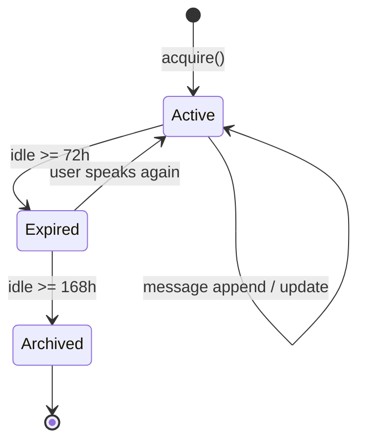
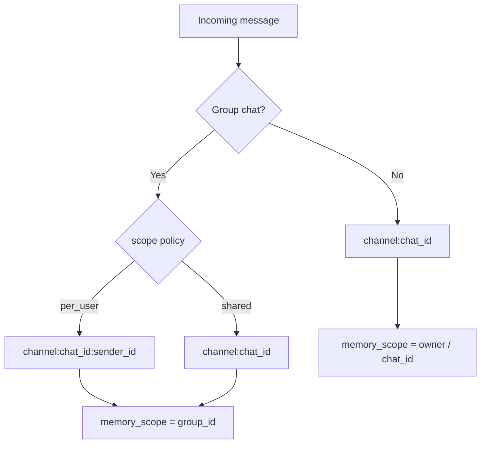

# Workspace, Session & Identity

codex-pro uses **Session** to isolate conversational context and concurrency scopes: each channel + chat combination owns an independent history and state, preventing ordinary context bleed.

!!! warning "A Session is not a tenant authorization boundary"
    A session key is routing and state scope, not an unforgeable security principal; session separation does not provide multi-tenant isolation. If mutually untrusted users require an authorization boundary, run separate instances, workspaces, databases, and credentials. See [Multi-client vs. multi-tenant boundaries](security-model.en.md#multi-client-tenant-boundary).

## Core Concepts

| Concept | Description |
|---------|-------------|
| Session key | Unique session identifier in the format `channel:chat_id` |
| SessionManager | Lifecycle manager responsible for creation, caching, expiry, and archival |
| Scoped session | In group chats with `per_user` policy, appends `:sender_id` to isolate per-user conversation context (not authorization) |
| Memory scope | Independent of session_key; determines long-term memory ownership |

## Session Key Composition

```mermaid
graph LR
    A[channel] -->|":"| B[chat_id]
    B -->|optional ":sender_id"| C[scoped key]
    
    subgraph Examples
        D["telegram:123456"]
        E["slack:C04ABC"]
        F["telegram:group_789:user_42"]
    end
```

- `channel` — integration channel identifier (telegram / slack / cron, etc.)
- `chat_id` — conversation identifier within that channel
- In group `per_user` mode, `:sender_id` is appended

## Session Lifecycle



- **Active** — receiving messages normally, LRU cache hit
- **Expired** — inactive beyond `expiry_hours=72`, can be reactivated
- **Archived** — inactive beyond `archive_hours=168`, removed from active storage

## Conversation Scoping & Isolation



- Group chat memory scope always binds to group_id, regardless of session isolation
- Private chat memory scope depends on whether an owner is bound (bound vs unbound)

## Persistence & Concurrency

**JSONL Storage**
- Each session maps to a single `.jsonl` file
- Filenames are encoded via `urllib.parse.quote()` (bijective mapping, no collisions)
- Automatic migration from legacy `"_"` separator scheme to `"%3A"` encoded scheme

**Concurrency Control**
- Each session holds an independent `asyncio.Lock`
- LRU cache capped at 200 entries; eviction never removes sessions with held locks
- Atomic writes with corrupt-data recovery

## History Alignment

`get_history(max_messages=500)` follows these rules when returning history:

1. Skips consolidated messages (beyond the `last_consolidated` pointer)
2. Discards orphaned tool results (results without a corresponding tool_use)
3. Aligns to a user message boundary — history always starts with a user message
