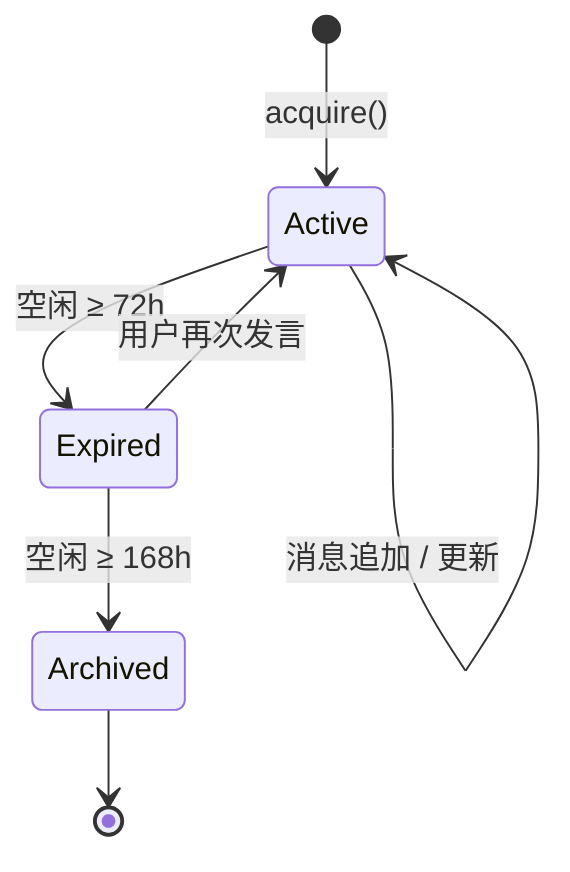
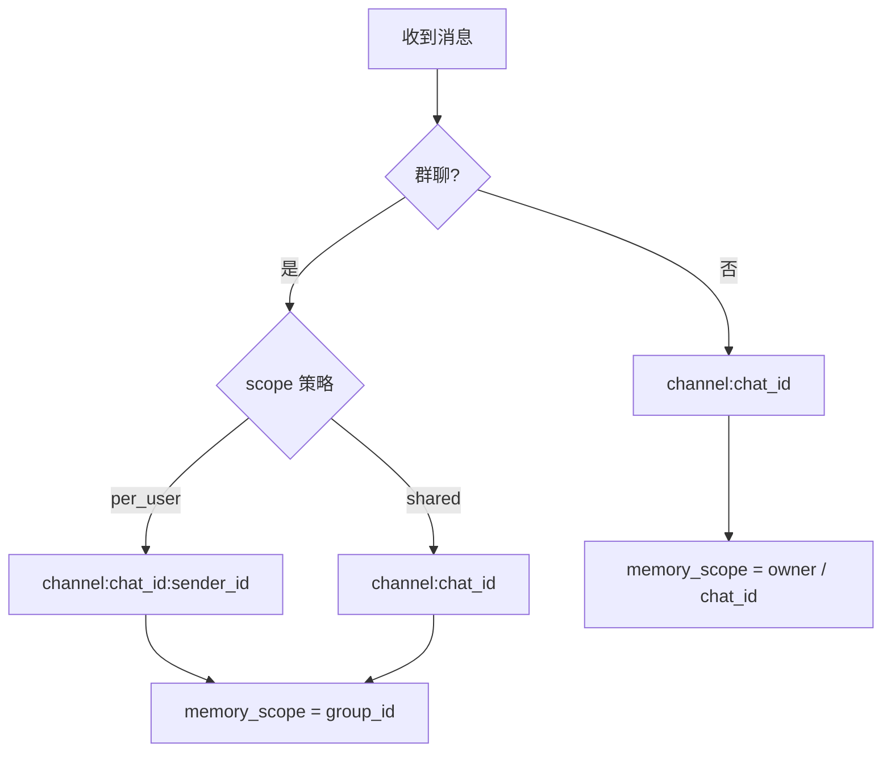

# 工作区、会话与身份

codex-pro 通过 **Session** 机制隔离对话上下文与并发作用域：每个 channel + chat 组合拥有独立的对话历史与状态，避免普通的上下文串扰。

!!! warning "Session 不是租户授权边界"
    Session key 是路由与状态作用域，不是不可伪造的安全主体；会话隔离不等于多租户隔离。若需要在不相信的用户之间建立权限边界，请使用独立实例、工作区、数据库与凭据。详见[多客户端与多租户边界](security-model.md#multi-client-tenant-boundary)。

## 核心概念

| 概念 | 说明 |
|------|------|
| Session key | 会话唯一标识，格式为 `channel:chat_id` |
| SessionManager | 会话生命周期管理器，负责创建、缓存、过期与归档 |
| Scoped session | 群聊中按 `per_user` 策略追加 `:sender_id`，隔离用户级对话上下文（不构成授权边界） |
| Memory scope | 独立于 session_key 的记忆作用域，决定长期记忆的归属 |

## Session Key 组成

```mermaid
graph LR
    A[channel] -->|":"| B[chat_id]
    B -->|可选 ":sender_id"| C[scoped key]
    
    subgraph 示例
        D["telegram:123456"]
        E["slack:C04ABC"]
        F["telegram:group_789:user_42"]
    end
```

- `channel` — 接入通道标识（telegram / slack / cron 等）
- `chat_id` — 该通道内的对话标识
- 群聊 `per_user` 模式下追加 `:sender_id`

## 会话生命周期



- **Active** — 正常接收消息，LRU 缓存命中
- **Expired** — 超过 `expiry_hours=72` 未活跃，可被重新激活
- **Archived** — 超过 `archive_hours=168`，从活跃存储移除

## 上下文作用域隔离



- 群聊的 memory scope 始终绑定 group_id，无论 session 是否隔离
- 私聊的 memory scope 取决于是否绑定 owner（bound vs unbound）

## 持久化与并发

**JSONL 存储**
- 每个 session 对应一个 `.jsonl` 文件
- 文件名使用 `urllib.parse.quote()` 编码（双射映射，无碰撞）
- 支持从旧版 `"_"` 分隔方案自动迁移到 `"%3A"` 编码方案

**并发控制**
- 每个 session 持有独立的 `asyncio.Lock`
- LRU 缓存上限 200，驱逐时不移除仍持有锁的 session
- 原子写入 + 损坏数据恢复机制

## 历史对齐

`get_history(max_messages=500)` 返回历史时遵循以下规则：

1. 跳过已 consolidate 的消息（`last_consolidated` 指针之后）
2. 丢弃孤立的 tool result（无对应 tool_use 的结果）
3. 对齐到 user message 边界——历史永远以 user 消息开头
