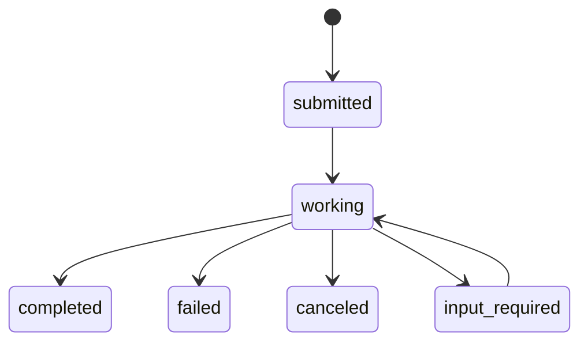

# A2A (Agent-to-Agent)

Codex Pro 提供 A2A 入站服务，让外部 Agent 发现它并向它委派文本任务。

---

## 概述

A2A 使 Agent 能通过 Agent Card 和 JSON-RPC 交换任务。当前生产运行时只接线了服务端（接收任务）：没有 CLI 子命令、Agent 工具或 peer 配置可将任务出站委派给其他 Agent。

## Agent Card

通过 `GET /.well-known/agent.json` 提供 Agent 描述卡片：

```json
{
  "name": "codex-pro",
  "description": "A modular AI agent framework",
  "url": "http://localhost:58123",
  "version": "0.1.0",
  "capabilities": {"streaming": false, "pushNotifications": false},
  "skills": [{"id": "chat", "name": "chat"}, {"id": "tool_use", "name": "tool_use"}],
  "authentication": {"schemes": ["bearer"]}
}
```

## JSON-RPC 端点

`POST /a2a`

### 方法

| 方法 | 说明 |
|------|------|
| `tasks/send` | 提交任务（同步请求/响应） |
| `tasks/get` | 查询任务状态 |
| `tasks/cancel` | 取消任务 |

### 任务状态流转



## 配置

Gateway 运行时自动启用 A2A。通过 `a2a` 配置节进行配置。

## 身份与任务隔离

Gateway 配置多个 API token 时，每个 token 会导出一个不透明 principal。任务存储、查询、取消、在飞运行句柄和 Agent 会话都按 principal 隔离：

- 不同 token 可同时使用相同的自定义 task ID，不会相互覆盖。
- 用 token B 查询或取消 token A 的任务，与查询一个不存在的 ID 一样返回 `Task not found`，不泄露归属。
- 认证请求的内部会话键为 `a2a:{opaque_hash}`，不包含 token 或其指纹；无 token 的单主体部署为了兼容仍使用 `a2a:{task_id}`。

## 出站客户端状态

代码包保留了低层 `A2AClient` Python 辅助类，但它当前没有生产调用方，也未经共享 `net_guard` 的逐跳 SSRF 校验和 DNS 钉住。因此它不是可供模型调用的出站委派能力，也不应向它传入模型生成或其他不可信 URL。

## 限制

- 不支持流式响应（`tasks/sendSubscribe` 未实现）
- 不支持推送通知
- 仅处理文本内容
- 尚无生产可用的出站 A2A 委派入口
- 任务存储有 TTL（默认 3600 秒）和数量上限（默认 1000）
