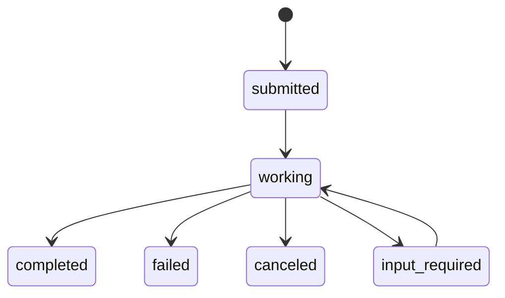

# A2A (Agent-to-Agent)

Codex Pro 提供 A2A 入站服务，也提供 `delegate_a2a` 工具，让 Agent 向远程 A2A peer 委派文本任务。

---

## 概述

A2A 使 Agent 能通过 Agent Card 和 JSON-RPC 交换任务。入站端接收外部任务；出站端由 `delegate_a2a` 工具发现 peer、发送任务、查询状态或取消任务。

## Agent Card

通过 `GET /.well-known/agent.json` 提供 Agent 描述卡片：

```json
{
  "name": "codex-pro",
  "description": "A modular AI agent framework",
  "url": "http://localhost:58123",
  "version": "0.1.0",
  "capabilities": {"streaming": false, "pushNotifications": false},
  "skills": [{"id": "chat", "name": "chat"}, {"id": "tool_use", "name": "tool_use"}],
  "authentication": {"schemes": ["bearer"]}
}
```

## JSON-RPC 端点

`POST /a2a`

### 方法

| 方法 | 说明 |
|------|------|
| `tasks/send` | 提交任务（同步请求/响应） |
| `tasks/get` | 查询任务状态 |
| `tasks/cancel` | 取消任务 |

### 任务状态流转


```mermaid
stateDiagram-v2
    [*] --> submitted
    submitted --> working
    working --> completed
    working --> failed
    working --> canceled
    working --> input_required
    input_required --> working
```

## 配置

Gateway 运行时自动启用 A2A。通过 `a2a` 配置节进行配置。

## 身份与任务隔离

Gateway 配置多个 API token 时，每个 token 会导出一个不透明 principal。任务存储、查询、取消、在飞运行句柄和 Agent 会话都按 principal 隔离：

- 不同 token 可同时使用相同的自定义 task ID，不会相互覆盖。
- 用 token B 查询或取消 token A 的任务，与查询一个不存在的 ID 一样返回 `Task not found`，不泄露归属。
- 认证请求的内部会话键为 `a2a:{opaque_hash}`，不包含 token 或其指纹；无 token 的单主体部署为了兼容仍使用 `a2a:{task_id}`。

## 出站委派

工具通过 `a2a.remote_agents` 注册常用 peer。`execution.network_policy` 必须允许出站网络；该工具带有 `network.outbound` capability，网络策略为 `deny` 时不会开放给 Agent。每个 peer 配置 `id`、`url`，可选 `description`：

```yaml
execution:
  network_policy: restricted
a2a:
  remote_agents:
    - id: research-peer
      url: "https://agent.example.com"
      description: "受管理员配置的研究代理"
```

`delegate_a2a` 支持 `send`、`get`、`cancel`；发送和取消是有副作用的执行操作，查询是只读操作。建议只配置运营方审核过的 peer。

!!! warning "出站 URL 尚未纳入统一 SSRF 防护"
    当前客户端对目标 URL 不执行共享 `net_guard` 的逐跳校验或 DNS 钉住；工具也允许调用时直接提供 `url`，而不只使用 `remote_agents` 中的注册目标。网络策略 capability 不是 URL/目标地址校验。不要向不可信调用方开放此能力，也不要将模型生成或用户提供的任意 URL 视为可信；远程部署前应先补齐目标 allowlist、SSRF 校验和 DNS 重绑定防护。

## 限制

- 不支持流式响应（`tasks/sendSubscribe` 未实现）
- 不支持推送通知
- 仅处理文本内容
- 出站目标的统一 SSRF 校验与 DNS 钉住尚未实现
- 任务存储有 TTL（默认 3600 秒）和数量上限（默认 1000）
