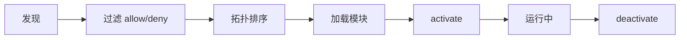

# 开发 Plugin

Codex Pro Plugin 开发指南。

---

## Plugin 结构

```
my-plugin/
├── plugin.yaml          # 清单文件（必须）
├── __init__.py          # 入口模块
└── tools/
    └── my_tool.py       # 自定义工具
```

## 清单文件 (plugin.yaml)

```yaml
name: my-plugin
version: "1.0.0"
description: "插件功能说明"
author: "作者"
requires_env: [MY_API_KEY]
provides:
  tools: [my_custom_tool]
  hooks: [pre_tool_call, post_tool_call]
kind: integration
config_key: my_plugin
depends_on: []
permissions:
  - tool.register
  - hook.register
```

## 入口模块

```python
from codex_pro.plugins import PluginContext

async def activate(ctx: PluginContext):
    """插件加载时调用。"""
    # 注册工具
    ctx.register_tool(MyTool(ctx.plugin_config))
    
    # 注册钩子
    ctx.register_hook("pre_tool_call", my_hook)

async def deactivate(ctx: PluginContext):
    """关闭时调用。"""
    pass
```

## PluginContext

通过 `ctx` 可访问：

| 属性 | 说明 |
|------|------|
| `ctx.config` | 全局 Codex Pro 配置 |
| `ctx.workspace` | 工作区路径 |
| `ctx.publish_outbound(...)` | 发布出站事件 |
| `ctx.subscribe_inbound(...)` | 订阅入站事件，停用时自动解除 |
| `ctx.register_tool(...)` | 注册工具，停用时由 PluginManager 回收 |
| `ctx.register_hook(...)` | 注册生命周期钩子 |
| `ctx.plugin_config` | 本 Plugin 配置（来自 `plugins.config.{config_key}`） |

## 权限模式

```yaml
plugins:
  permissionMode: strict  # strict | compat
```

| 模式 | 行为 |
|------|------|
| `strict` | 缺少 `tool.register` / `hook.register` 声明时拒绝对应注册 |
| `compat` | 未声明任何权限的旧插件默认获得工具/钩子注册权限；显式声明时仍按声明检查 |

!!! warning "权限声明不是进程隔离"
    Python 插件是受信任的进程内代码。只有 `tool.register` 与 `hook.register` 在注册时强制执行；`network`、`subprocess` 和 `filesystem.*` 只是声明性元数据。

## 分发方式

1. **本地目录** — 放置在 plugins 目录或 `plugins.extraDirs` 指定的路径
2. **Python 包** — 通过 pyproject.toml 的 `[project.entry-points."codex_pro.plugins"]` 注册

## CLI 管理

```bash
codex-pro plugin list      # 列出已安装插件
codex-pro plugin info <name>   # 查看插件详情
codex-pro plugin enable <name>  # 启用
codex-pro plugin disable <name> # 禁用
codex-pro plugin check          # 检查所有插件状态
```

## 生命周期


