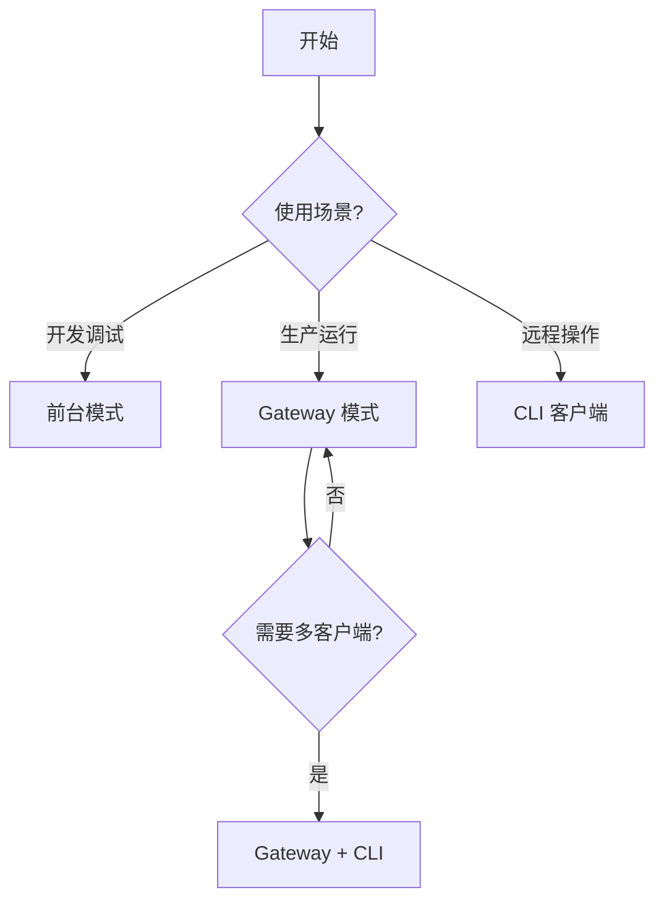

# 运行模式

Codex Pro 提供三种运行模式，适用于从本地开发到生产部署的不同场景。

---

## 模式对比

| 特性 | 前台模式 (`run`) | Gateway 模式 | CLI 客户端 |
|------|-----------------|-------------|-----------|
| 启动命令 | `codex-pro run` | `codex-pro gateway start` | `codex-pro cli` |
| 进程生命周期 | 随终端退出 | 系统服务托管 | 随终端退出 |
| 记忆持久化 | 是 | 是 | 依赖 Gateway |
| 多客户端接入 | 否 | 是 | — |
| 适用场景 | 开发调试 | 生产运行 | 远程操作 |
| 资源占用 | 完整运行时 | 完整运行时 | 仅网络客户端 |
| 自动重启 | 否 | 是（systemd/launchd） | — |

---

## 前台模式

最简单的运行方式，适合开发和调试：

```bash
codex-pro run
```

进程在当前终端前台运行，所有日志直接输出到 stdout/stderr。关闭终端或 `Ctrl+C` 即停止。

### 典型用途

- 本地开发与调试
- 功能验证
- 配置测试
- 单次任务执行

### 配置示例

运行模式由启动命令决定，不是配置项 —— `runtime` 节只有 `single_instance` 一个字段，没有 `mode`。日志级别配在 `observability`：

```yaml
# ~/.codex-pro/config.yaml
observability:
  log_level: DEBUG    # 前台调试常用更详细的日志

runtime:
  single_instance: true   # 同一工作区只允许一个实例
```

!!! tip "调试技巧"
    日志级别只能通过配置文件或 `CODEX_PRO_OBSERVABILITY__LOG_LEVEL=DEBUG` 环境变量设置，`codex-pro run` 没有 `--log-level` 参数。

---

## Gateway 模式

生产环境推荐模式。Gateway 以后台服务形式运行，提供 HTTP API 供多个客户端接入：

```bash
# 安装为系统服务
codex-pro gateway install

# 启动服务
codex-pro gateway start

# 查看状态
codex-pro gateway status

# 查看日志
codex-pro gateway logs
```

### 架构概览

```
┌─────────────┐     ┌─────────────┐     ┌─────────────┐
│  CLI Client │     │  Codex Pro  │     │  API 调用方  │
└──────┬──────┘     └──────┬──────┘     └──────┬──────┘
       │                   │                   │
       └───────────────────┼───────────────────┘
                           │ HTTP (localhost)
                    ┌──────▼──────┐
                    │   Gateway   │
                    │  (后台服务)  │
                    ├─────────────┤
                    │ Agent 运行时 │
                    │ 记忆 / 知识库 │
                    │ 工具执行引擎  │
                    └─────────────┘
```

### Gateway 环境标识

Gateway 进程启动时会设置环境变量 `_CODEX_PRO_GATEWAY=1`，用于内部逻辑区分运行上下文。插件和工具可通过此变量判断当前是否在 Gateway 环境中运行。

### 认证配置

Gateway 支持三种认证模式：

| 模式 | 说明 | 适用场景 |
|------|------|---------|
| `open` | 无认证，任何本地请求可访问 | 仅本地开发 |
| `allowlist` | 基于 Token 白名单 | 受信任客户端共享（非租户级隔离） |
| `pairing` | 配对码认证 | 首次设备接入 |

```yaml
# ~/.codex-pro/config.yaml
gateway:
  host: 127.0.0.1
  port: 58123
  auth:
    mode: allowlist
    api_tokens:
      - "token-user-alice"
      - "token-user-bob"
    admin_tokens:
      - "token-admin-root"
    token_header: "X-Codex Pro-Token"
    allowed_origins:
      - "http://localhost:3000"
    allowed_hosts:
      - "localhost"
```

!!! warning "多客户端不等于多租户"
    `api_tokens` 与 `admin_tokens` 区分请求是否可读/可管理，但普通 Token 不是所有资源通用的用户主体。Codex Pro 和多个 API 展示的是整个实例的状态。互不信任的用户应使用独立实例与数据目录，详见[安全模型](../concepts/security-model.md#multi-client-tenant-boundary)。

!!! warning "网络绑定"
    默认绑定 `127.0.0.1`，仅接受本地连接。如需远程访问，请先完成 [安全加固](security-hardening.md) 再修改绑定地址。

### 服务管理命令

```bash
codex-pro gateway install    # 注册系统服务
codex-pro gateway uninstall  # 移除系统服务
codex-pro gateway start      # 启动
codex-pro gateway stop       # 停止（60 秒超时）
codex-pro gateway restart    # 重启
codex-pro gateway status     # 查看运行状态
codex-pro gateway logs       # 查看日志
```

!!! note "停止超时固定为 60 秒"
    `codex-pro gateway stop` 最多等待 60 秒让进程优雅退出，该值硬编码在服务层，没有对应的配置项。

    正常关停远快于此。若持续触到这一上限，通常是某个长耗时工具调用（浏览器会话、外部请求）尚未收尾，从日志确认卡在哪一步比调整超时更有意义。

---

## CLI 客户端模式

CLI 客户端连接到已运行的 Gateway，提供与前台模式一致的交互体验：

```bash
codex-pro cli
```

### 工作原理

CLI 客户端本身不运行 Agent 逻辑，而是通过 WebSocket 与本机
loopback Gateway 通信：

```
┌──────────────┐         ┌──────────────┐
│  codex-pro  │   WS    │   Gateway    │
│     cli      │───────▶│   (本机)     │
└──────────────┘         └──────────────┘
```

### 连接配置

```bash
# 端口和 token 默认来自 Gateway 配置
codex-pro cli

# 必要时覆盖端口/token；全屏界面需显式选择
codex-pro cli --port 58123 --token your-api-token
codex-pro cli --tui
```

### 适用场景

- 通过 SSH 端口转发后操作远程 Gateway（客户端仍只连 loopback）
- 多终端同时接入同一 Agent 实例
- 轻量级客户端环境（默认 inline 界面无需 Textual）

---

## 模式选择建议



!!! tip "从前台迁移到 Gateway"
    开发阶段使用 `codex-pro run` 验证配置无误后，执行 `codex-pro gateway install && codex-pro gateway start` 即可切换到生产模式，配置文件完全通用，无需修改。
